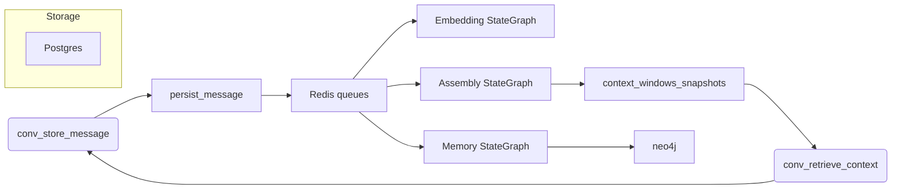

# High-Level Design: Context Broker
**Date:** 2026-03-20T17:55:09Z

## 1. System Overview
The Context Broker is a standalone context engineering and conversational memory service. It sits between agents and the infinite conversation store, transforming every stored message into purpose-built context windows, extracted knowledge graph facts, and ready-to-use conversational memories. The system implements the capabilities detailed in the concept paper:

- **Infinite conversation substrate:** every message is persisted indefinitely, forming the raw inputs to episodic and semantic memory.
- **Purpose-built context windows:** build types encode proportional budgets for archival summaries, chunk summaries, recent verbatim history, semantic retrieval, and knowledge graph facts.
- **Two-layer memory:** episodic memory (messages + summaries) and semantic memory (knowledge graph facts) can be mixed per build type.
- **Proactive assembly:** each stored message triggers asynchronous pipelines so context is pre-assembled when an agent requests it.

The Context Broker implements these capabilities as LangGraph StateGraphs. Each interface (MCP, OpenAI-compatible chat) is a thin proxy into compiled flows. Infrastructure (Action Engine) is separated from intelligence (Thought Engine) and entirely driven by configuration, enabling the State 4 MAD promise: the same code runs standalone or within any ecosystem simply by pointing `config.yml` at the desired providers.

## 2. Container Architecture

| Container | Role | Image | Ports | Volumes | Networks |
|---|---|---|---|---|---|
| `context-broker` | Nginx gateway and protocol boundary | `nginx:1.26` | `80:80` | `/config`, `/data` | `default`, `context-broker-net` |
| `context-broker-langgraph` | Python LangGraph runtime (StateGraphs + Imperator + queue worker) | custom `context-broker-langgraph` | internal `8000` | `/config`, `/data` | `context-broker-net` |
| `context-broker-postgres` | PostgreSQL 16 + `pgvector` for vectors and persistent records | `pgvector/pgvector:pg16` | internal `5432` | `/data/postgres` | `context-broker-net` |
| `context-broker-neo4j` | Neo4j 5 + APOC | `neo4j:5.11` | internal `7687`, `7474` | `/data/neo4j` | `context-broker-net` |
| `context-broker-redis` | Redis 7 (queues, locks, ephemeral state) | `redis:7-alpine` | internal `6379` | `/data/redis` | `context-broker-net` |

Each container mounts `/config` (bind-mounted from host `./config`) for configuration and credentials, and `/data` (bind-mounted from host `./data`) for generated state. The gateway is the sole container on the external network; it proxies MCP, chat, health, and metrics traffic to LangGraph over the private bridge. All inter-container communication uses service names.

### Volume layout
```
/config/config.yml
/config/credentials/.env
/data/postgres/
/data/neo4j/
/data/redis/
/data/imperator_state.json
```
`imperator_state.json` stores the persistent conversation ID for the Imperator; it is created/read by the Imperator flow on boot.

### Gateway responsibilities
- Proxy `/mcp` HTTP/SSE endpoints to LangGraph container.
- Proxy `/v1/chat/completions` (OpenAI-compatible) to LangGraph for the Imperator flow.
- Proxy `/health` to LangGraph, simply relaying the aggregated dependency status response.
- Expose Prometheus metrics scraped from LangGraph on `/metrics` (LangGraph produces metrics).

## 3. LangGraph Flow Designs
Each LangGraph flow is a directed graph of node functions returning new state dicts. Standard LangChain components replace ad-hoc implementations where possible.

### 3.1 Message Pipeline (`conv_store_message`)
**Purpose:** Persist the incoming message and enqueue downstream jobs.

**Nodes & state:**
1. `parse_input` – validates MCP schema (conversation_id, sender_id, role, content, metadata).
2. `deduplicate` – fetches the latest message via LangChain `SQLDatabaseChain` or direct `asyncpg` call orchestrated via `LangGraphDB` helper, comparing sender+content to drop duplicates.
3. `persist_message` – inserts row into `conversation_messages` (Postgres) using `asyncpg` connection pool managed by `LangGraphDB`.
4. `enqueue_jobs` – pushes serialization key to Redis queues (`embedding_jobs`, `context_assembly_jobs`, `memory_extraction_jobs`) via `aioredis`. Stores a context-assembly lock key to avoid concurrent builds.
5. `ack_response` – returns success immediately; the rest runs asynchronously.

**State schema:**
```
{ "conversation_id": str,
  "message_id": UUID,
  "sequence_number": int,
  "token_count": int,
  "build_type_id": str,
  "job_ref": {...}
}
```

### 3.2 Embedding Pipeline (LangGraph queue worker for `embedding_jobs`)
**Nodes:**
1. `fetch_message_for_embedding` – loads the stored message plus preceding N messages via Postgres query (use LangChain `SQLDatabase` w/ curated SQL).
2. `call_embedding_model` – uses LangChain `Embeddings` class configured by `config.yml` (`OpenAIEmbeddings`, `HuggingFaceEmbeddings`, or any OpenAI-compatible service via `LangGraphProviders`). Tokens are trimmed to N-message prefix.
3. `store_embedding` – writes vector to `conversation_messages.embedding` (Postgres) using `asyncpg` or `SQLModel` wrapper; updates `embedding_generated_at` timestamp.
4. `signal_context_assembly` – marks embedding ready; queue entry for context assembly is idempotent.

LangGraph nodes reuse LangChain retriever components by encapsulating vector stores behind official `PostgresVectorStore` or `PGVector` wrappers.

### 3.3 Context Assembly Flow (triggered per context window when thresholds exceeded)
**Nodes:**
1. `load_context_metadata` – loads context window record, build type config, and relevant token budget (auto-resolved via provider metadata or fallback). Uses SQL query through `LangChainSQLDatabase`. 
2. `collect_tier_summaries` – selects archival summaries (tier1), chunk summaries (tier2), and recent messages (tier3). Each section uses LangChain `PGVectorStoreRetriever` for similarity, but for summaries it reads pre-generated rows. The proportion is enforced by iteratively subtracting consumed tokens until token budget satisfied.
3. `semantic_retrieval` (knowledge-enriched build only) – uses LangChain `VectorStoreRetriever` backed by `PGVector` table `conversation_messages` to retrieve semantically relevant previous messages outside the recent window.
4. `knowledge_graph_retrieval` (knowledge-enriched only) – queries Neo4j via `Neo4jGraph` component and `Neo4jVectorStore` (or `Neo4jVectorRetriever`) to fetch relevant entity nodes/facts tied to the conversation's participants. Traversals incorporate relationship scores derived from Fact edges, followed by optional RRF reranking (configurable reranker provider).
5. `assemble_context_window` – concatenates sections in order: tier1 summary, tier2 chunk summary, tier3 recent verbatim, optionally semantic hits, optionally knowledge facts. Inserts markers describing sections and provenance.
6. `store_context_window_snapshot` – writes assembled window to `context_windows_snapshots` table (JSON) and updates `context_windows.last_assembled_at`.
7. `publish_event` – pushes completion notification to Redis stream for any waiting retrieval call.

Each node uses new state dicts; e.g., `assemble_context_window` returns {"assembled_text": str, "provenance": [...], "tokens_used": int}.

### 3.4 Retrieval Flow (`conv_retrieve_context`)
- Waits for `context_windows_snapshots` entry; if assembly in progress, subscribes to Redis stream with SSE-style waiting (LangGraph checkpoint/resume). No blocking external locks.
- Returns window text plus metadata (token counts, sections, build type, retrieval timestamps). This flow is purely read; no new writes.

### 3.5 Memory Extraction Flow (`memory_extraction_jobs`)
**Nodes:**
1. `fetch_messages_for_memory` – collects candidate chunks (recent messages or chunk summaries) and runs them through a `SecretFilter` node (redacts secrets before extraction).
2. `call_knowledge_extractor` – uses LangChain chat model (configured `llm` provider) with prompt template to produce facts/memories.
3. `store_in_graph` – sends extracted JSON to Neo4j via LangChain `Neo4jGraph` connector, creating `Conversation`, `Entity`, and `Fact` nodes with relationships `MENTIONS`, `RELATED_TO`, etc.
4. `update_memory_status` – flags `conversation_messages.memory_extracted = true`.

Each extracted fact carries hashes to deduplicate (unique constraint on `(conversation_id, fact_hash)`), aligning with requirement for Mem0 dedup.

### 3.6 Imperator Flow
- The Imperator is a StateGraph that consumes `/v1/chat/completions`. Incoming messages are mapped to LangChain chat model calls configured via `config.yml`.
- Nodes: `validate_request`, `append_to_imperator_conversation` (writes message via `conv_store_message` internally), `retrieve_context` (uses chosen `integrated_build_type`), `call_chat_model`, `emit_response` (streams SSE `data: {...}` chunks).
- Imperator maintains identity/purpose from config and includes `toolbelt` entries describing available MCP tools. When `admin_tools: true`, nodes can read/write `config.yml` and run restricted SQL queries through LangChain `SQLDatabaseChain` with read-only credentials.
- A persistent conversation ID stored in `/data/imperator_state.json` ensures continuity across restarts; if absent, the Imperator self-initialises via `conv_create_conversation`.

## 4. Database Schema

### PostgreSQL
Tables mirror the requirements, implemented via migrations at startup.

| Table | Purpose | Key columns/indexes |
|---|---|---|
| `conversations` | Master record (flow_id, title, participants aggregated) | PK `id`, indexes on `flow_id`, `user_id` |
| `conversation_messages` | All messages with metadata | `sequence_number`, `content`, `role`, `sender_id`, `embedding vector(768)`, `content_tsv` (stored), indexes: `idx_messages_conversation`, `idx_messages_seq`, `ivfflat` on embedding (vector_cosine_ops, `lists=100`), GIN on `content_tsv` |
| `context_window_build_types` | Build type strategy metadata | `id`, `tier` proportions, `knowledge_graph_pct`, `semantic_retrieval_pct` |
| `context_windows` | Per-participant per-build-type token budget | PK `id`, FK to `conversations`, fields `max_token_limit`, `resolved_token_limit`, `build_type_id`, `last_assembled_at` |
| `conversation_summaries` | Tiered summaries (tier1 archival, tier2 chunk) | `summary_text`, `summary_embedding vector`, `tier`, `summarizes_from_seq`, `is_active`, indexes on `context_window_id`, `ivfflat` for embeddings, plus `superseded_by` references. |
| `context_windows_snapshots` | Latest assembled window | JSON payload with sections, retrieval metadata. |
| `memory_fact_hashes` | Dedup control for knowledge extraction | Unique constraint on `(conversation_id, fact_hash)` |

Migrations run at startup; the runtime checks `schema_migrations` table and applies missing SQL scripts, failing if incompatible.

### pgvector indexes
Both `conversation_messages.embedding` and `conversation_summaries.summary_embedding` are indexed via `ivfflat` indexes tuned per dataset, enabling LangChain `PGVectorStore` retrievers for semantic retrieval and chunk similarity.

### Neo4j Model
Graph schema used by extraction and knowledge-enriched retrieval:

- `Conversation` nodes (`conversation_id`, `flow_id`).
- `Participant` nodes (`sender_id`, `role`, `display_name`).
- `Entity` nodes (`name`, `type`, `aliases`).
- `Fact` nodes (`text`, `fact_hash`, `confidence`, `source_message_id`).
- Relationships: `(:Conversation)-[:CONTAINS]->(:Fact)`, `(:Fact)-[:MENTIONS]->(:Entity)`, `(:Fact)-[:RELATED_TO]->(:Fact)`; `(:Entity)-[:ASSOCIATED_WITH]->(:Participant)`.
- Query support uses Neo4j full-text indexes (APOC) and `Neo4jVectorStore` for semantic similarity. 
- Facts carry `knowledge_tag` (e.g., preference, decision) to allow build types to request only certain categories.

### Redis Usage
- **Queues:** Lists/Sorted Sets for `embedding_jobs`, `context_assembly_jobs`, `memory_extraction_jobs`. Sorted sets allow priority; lists for simple FIFO.
- **Locks:** `context_window:{id}:lock` keys with TTL to prevent concurrent assembly.
- **Streams:** `context_window_updates` notify waiting retrieval clients.
- **Dedup and heartbeat metadata** stored as hashes per job to support retries and monitoring.

## 5. MCP Tool Interface
LangGraph registers tools via configuration; each MCP tool is implemented as a compiled StateGraph that adheres to the MCP input schema. All tools share a common structure:

```
{ "tool_name": {
    "description": "...",
    "method": "POST",
    "input_schema": {...},
    "stategraph": "conv_store_message_graph", // compiled graph
    "response_formatter": "json"
}}
```

### Tools overview
- `conv_create_conversation` – inserts conversation, returns ID and metadata.
- `conv_store_message` – entry point described above.
- `conv_retrieve_context` – returns latest assembled window (blocks via Redis stream up to 50s before failing).
- `conv_create_context_window` – instantiates `context_windows` row, resolves token limit (auto vs explicit), stores preferred build type, optionally sets `semantic/knowledge flags`.
- `conv_search`, `conv_search_messages` – use LangChain `VectorStoreRetriever` on `conversation_messages` embeddings plus BM25 (via Postgres full-text `content_tsv`). Reranking optional via configured reranker provider (local cross-encoder or remote OpenAI). Hybrid retrieval uses RRF of vector and textual ranks.
- `conv_get_history` – simple chronological query via LangChain `SQLDatabase` and `ConversationMessages` table.
- `conv_search_context_windows` – queries `context_windows`, optionally filtering by build type or participant.
- `mem_search`, `mem_get_context` – Neo4j-powered graph retrieval, optionally augmented by vector similarity (via `Neo4jVectorStore`) for the knowledge graph facts.
- `broker_chat` – wraps Imperator flow; streams SSE to client.
- `metrics_get` – returns Prometheus-format counters exported by LangGraph runtime.

Each tool declares `inputSchema` for MCP discovery, uses Pydantic sanitization inside LangGraph nodes, and returns typed JSON output.

## 6. OpenAI-Compatible Chat Interface
The gateway proxies `POST /v1/chat/completions` to LangGraph. LangGraph maps the request into the Imperator StateGraph:

1. `validate_chat_payload` – checks `model`, `messages`, `stream`, `temperature`, etc.
2. `fetch_imperator_context` – calls `conv_retrieve_context` internally with Imperator build type (defaults to `standard-tiered`), retrieving sections plus metadata.
3. `build_chat_prompt` – merges system/instruction prompt (Imperator identity/purpose), retrieved context, and user messages into final prompt.
4. `call_chat_model` – uses LangChain chat model configured in `config.yml` for the chat provider (OpenAI-compatible). Streaming responses are emitted as SSE `data: {...}` events per chunk.
5. `record_imperator_response` – stores the Imperator's assistant message via `conv_store_message` to keep history.

The Imperator flow ensures `/v1/chat/completions` produces OpenAI-compliant responses while still building on the same context pipelines as MCP tools.

## 7. Configuration System (`config.yml`)
All runtime behavior (providers, build types, token budgets, logging, provider sources) is driven by `/config/config.yml`. Key sections:

### `providers`
```
providers:
  llm:
    base_url: https://api.openai.com/v1
    model: gpt-4o-mini
    api_key_env: LLM_API_KEY
  embeddings:
    base_url: https://api.openai.com/v1
    model: text-embedding-3-small
    api_key_env: EMBEDDINGS_API_KEY
  reranker:
    provider: cross-encoder
    model: BAAI/bge-reranker-v2-m3
```
Each slot can point to any OpenAI-compatible endpoint. The LangGraph provider layer reads `api_key_env` from `/config/credentials/.env`, allowing secrets to stay outside the repository.

### `build_types`
Defines tier proportions plus which retrieval layers are enabled. Defaults include:
- `standard-tiered`: three-tier episodic only.
- `knowledge-enriched`: adds `knowledge_graph_pct` and `semantic_retrieval_pct` sections.
Deployed build types can add `document_injection`, `knowledge_dominant`, etc.

### `imperator`
Defines `build_type`, `max_context_tokens`, `admin_tools` flag, default token budget, and identity/purpose text. `admin_tools: true` unlocks read-only SQL tasks and config editing nodes within the Imperator graph.

### `packages`
Controls StateGraph package source (local wheels directory, PyPI public, devpi). Kernel installs packages per this configuration on startup, fulfilling the State 4 requirement.

### `networking` and `storage`
Defines database connection strings (Postgres, Neo4j, Redis), queue names, and volume paths. Infrastructure config requires container restart when changed.

### `logging`
Levels, structured JSON toggles, and destinations are configured here. Default level is `INFO`, adjustable live by editing the file (LangGraph reloads config on each operation).

## 8. Build Types and Retrieval Pipeline

### `standard-tiered`
- **Tier1 (archival):** archival summary stored in `conversation_summaries` with `tier=1`. Summaries inserted/generated during context assembly using LangChain chat model summarizer (configured via `llm` provider). Each summary carries `summary_embedding` for similarity.
- **Tier2 (chunk):** chunk summaries covering mid-aged conversation segments, stored similarly.
- **Tier3 (verbatim):** most recent messages retrieved verbatim via SQL query, respecting token budgets.
- **Token budget resolution:** uses configured LLM context limit (from provider metadata `GET /v1/models/<model>`) or `fallback_tokens` per build type. `max_context_tokens` resolved at context window creation and persisted.
- **No semantic/knowledge retrieval:** `knowledge_graph_pct` and `semantic_retrieval_pct` are zero.

### `knowledge-enriched`
Activates additional pipeline stages:
1. **Semantic Retrieval:** After Tier3, `PGVectorRetriever` executes vector similarity search against `conversation_messages` embeddings (excluding the most recent `tier3` window) using LangChain `VectorStoreRetriever` with optional reranker. Results are sorted, limited by `semantic_retrieval_pct` of budget, and inserted after Tier3.
2. **Knowledge Graph Retrieval:** Run Neo4j traversals for facts/entities connected to the current conversation/participants. `Neo4jGraph` executes parameterized Cypher queries (e.g., `MATCH (c:Conversation {id:$conversation_id})-[:CONTAINS]->(f:Fact)-[:MENTIONS]->(e:Entity) RETURN ... ORDER BY f.relevance DESC LIMIT $n`). Each fact includes provenance message references. This stage fills `knowledge_graph_pct` of budget.
3. **Assembly order:** Tier1 -> Tier2 -> Tier3 -> Semantic hits -> Knowledge facts. Each section includes metadata so downstream prompt templates can label them.
4. **Fallback:** If Neo4j is unavailable, the system logs a warning, marks the window as `knowledge_graph_missing`, and continues with the episodic layers.

### Retrieval Strategy Differences
- `standard-tiered` relies solely on proactively generated summaries and recent messages. It is low-cost and resilient.
- `knowledge-enriched` blends summarization with RAG-style retrieval, enabling agents to reason about non-recent but semantically relevant content and explicit facts.
- Build types control whether `knowledge_graph_pct`/`semantic_retrieval_pct` are non-zero and whether the relevant flows fire. This gives deployers fine-grained control over inference cost versus capability.

## 9. Queue and Async Processing
All background work is queued in Redis and processed by the LangGraph queue worker inside the `context-broker-langgraph` container. Job types:
- `embedding_jobs`: triggered per stored message; processed by the embedding flow.
- `context_assembly_jobs`: triggered when a context window reaches its `trigger_threshold_percent` of tokens; processed by the assembly flow.
- `memory_extraction_jobs`: triggered after a message is saved and optionally once per time window per conversation; processed by the extraction flow.

**Lifecycle:**
1. Message is stored (`conv_store_message`).
2. Jobs enqueued with priority metadata and `attempt` counter.
3. Workers poll Redis (sorted set for priority, list for FIFO). Each worker is an async task running a LangGraph StateGraph with explicit state. Nodes use `await asyncio.sleep()` between polls to avoid blocking.
4. On success, job removed; on failure, exponential backoff increments `attempt` and requeues. After `MAX_ATTEMPTS`, job moves to `dead_letter_jobs` list.
5. A periodic dead-letter sweep requeues jobs (score resets) and logs metrics.
6. Each job writes structured logs and Prometheus counters (`queue_depth`, `jobs_processed`, `jobs_failed`).

**Idempotency & eventual consistency:**
- Jobs are idempotent: embedding reuses `message_id`, context assembly writes snapshots keyed by `context_window_id`, memory extraction uses fact hashes.
- Postgres is source-of-truth; background jobs enrich derived stores (summaries, Neo4j). Consistency is eventual: retrieval may lag behind message storage but per requirement the conversation record itself is never dropped.

**Alternative approaches:**
- The existing pattern of Redis-based queue worker is retained because it provides low-latency priority handling and fits into the containerized, self-contained deployment model. We wrap it in LangGraph StateGraphs to preserve observability and make each step explicable.

## 10. Imperator Design
The Imperator is the built-in conversational agent consuming the Context Broker's capabilities.

**Identity & Purpose:**
Defined in `config.yml` (name, persona, purpose statement). It is a registered MCP client that describes itself via `toolbelt` metadata (list of tools, access levels). This identity is included in every prompt as system instructions.

**Tool belt:**
- Read-only: `conv_retrieve_context`, `conv_search`, `mem_search`, `metrics_get`.
- Optional admin tools (if `admin_tools: true`): `config_edit`, `readonly_sql_query`, `broker_chat_debug`.

**Persistent conversation:**
- The conversation ID is stored in `/data/imperator_state.json`. On boot, if the ID exists, the Imperator reuses it via `conv_create_conversation` validation. If not, it creates a new conversation and writes the file.

**Purpose-driven reasoning:**
- The Imperator always uses the configured build type (`standard-tiered` default). Changing `imperator.build_type` flips to `knowledge-enriched` so the Imperator can showcase the full retrieval pipeline.
- Its prompt includes context about the current system state, recent metrics, and any outstanding alerts from the health flow.

**Admin capabilities:**
- When `admin_tools` is true, the Imperator graph exposes nodes that can read/write `config.yml` (through Docker bind mount) and run read-only SQL queries via LangChain `SQLDatabase`. These nodes enforce schema validation before writing config, maintaining safety.

**Tool invocation:**
The Imperator uses the same MCP tools as any client; the LangGraph flow simply routes through the internal StateGraph, ensuring there are no special cases.

## Appendices

### Mermaid: Container Network
```mermaid
flowchart TB
  subgraph External Network
    browser[Client]
    browser -->|SSE/HTTP| nginx_gateway[context-broker (nginx)]
  end
  subgraph Internal Network
    nginx_gateway --> langgraph[context-broker-langgraph]
    langgraph --> postgres[context-broker-postgres]
    langgraph --> neo4j[context-broker-neo4j]
    langgraph --> redis[context-broker-redis]
  end
```

### Mermaid: Flow Overview

