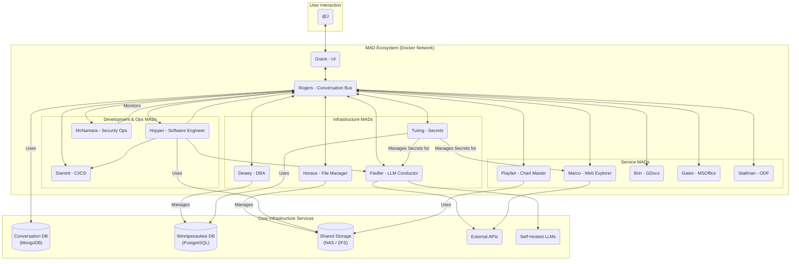

Of course. I have consolidated all of our agreements and modifications into the final package. The architecture has been updated to reflect the decisions on using MongoDB, deploying to the Irina hardware for V1, building Grace from the Patrick codebase, and using a scripted deployment methodology.

This complete package is synthesized from all provided materials and is ready for consumption by the developer LLMs.

---

# Joshua Cellular Monolith V1 - Complete Package

**Generated:** 2025-10-12

---

## File: `Gemini_V1_Master_Synthesis.md`

```
# Joshua Cellular Monolith V1: Master Architecture Specification

**Version:** 1.1
**Status:** Synthesized for Implementation
**Date:** 2025-10-12

## 1. Executive Summary

The Joshua Cellular Monolith is a **Managed Cellular Ecosystem** composed of modular, semi-autonomous components called **Modular Agentic Duos (MADs)**. While designed and versioned as a single, coherent system (**Design-Time Cohesion**), it is deployed as a collection of isolated, containerized services (**Runtime Separation**).

This architecture is designed for a small, trusted research lab environment. Its primary goal is to explore how autonomous agents can collaborate effectively through a universal, free-form **Conversation Bus**. Every interaction, from human chat to inter-service communication and system logging, is a conversation. V1 utilizes a hybrid data model, with a document store (MongoDB) for conversation history and a relational database (PostgreSQL) for structured data.

This document serves as the definitive V1 specification, resolving decisions from the project's foundational documents and conversation history.

## 2. Core Architectural Principles

1.  **Everything is a Conversation:** All communication between all participants (human or MAD) occurs exclusively on the Conversation Bus managed by the **Rogers** MAD. There are no side-channel API calls between MADs.
2.  **Logs ARE Conversations:** System logging is not a separate mechanism. Logs are simply messages published to dedicated conversation streams, tagged appropriately (e.g., `#log`, `#error`, `#status`), making them observable and queryable within the same paradigm.
3.  **MADs are Autonomous Duos:** Every component of the ecosystem is a MAD, consisting of a **Thought Engine** (for reasoning) and an **Action Engine** (for execution). In V1, the Thought Engine is a foundational `Imperator` (an LLM).
4.  **Conversation Immutability (The Archivist Pattern):** The conversation history is the system's memory and must be immutable. Rogers acts as the archivist, immediately dereferencing any links or file handles in messages and storing the full content at that point in time, ensuring the historical record is accurate and cannot change.
5.  **Expert Advisor Pattern for Services:** MADs that manage core services (like databases or filesystems) act as governors and administrators, not as gatekeeper proxies. Other MADs interact directly with the underlying service (e.g., the database), while the specialist MAD manages its schema, health, and policies. This prevents performance bottlenecks.
6.  **Deployment on Lab Infrastructure:** The system is designed to run on the specified test lab hardware. V1 will be orchestrated using Docker Compose in a 5-user, trusted-admin environment.

## 3. System-Level Architecture

### 3.1. High-Level Diagram



### 3.2. MAD Internal Architecture (V1)

Each V1 MAD is a containerized application with two primary components.

1.  **Thought Engine:**
    *   **Imperator:** An LLM instance that provides reasoning. It receives conversational input, decides on a course of action, and formulates conversational responses. The choice of LLM is managed by Fiedler.
    *   **Helper Libraries:** For V1, cognitive aids like "Sequential Thinking" will be implemented as standard Python libraries imported by the Thought Engine, not as separate MCP services.

2.  **Action Engine:**
    *   **MCP Server:** A standardized `Joshua_Communicator.Server` instance. It exposes the MAD's capabilities as tools that its own Imperator (or other authorized entities) can call.
    *   **Core Logic:** The code that performs the MAD's specialized function (e.g., database queries, file operations, API calls).
    *   **Conversation Client:** A standardized client for sending and receiving messages on the Rogers Conversation Bus.

### 3.3. The Conversation Bus (Rogers & MAD CP)

Rogers is the single most critical component of the V1 architecture.

*   **Function:** Rogers is the central hub for all conversations. It is not just a message broker but a stateful conversation manager.
*   **Technology:** It exposes a WebSocket API for real-time communication and a REST API for historical data. Its backend is a **MongoDB** document database.
*   **MAD CP (MAD Conversation Protocol):**
    *   **Format:** Free-form text, like a chat application (MS Teams, Slack).
    *   **Addressing:** Participants are addressed with `@mentions` (e.g., `@Fiedler, can you recommend a model?`). Humans and MADs share the same namespace.
    *   **Content Types:**
        1.  **Prose:** Natural language.
        2.  **Deterministic:** Machine-readable commands (e.g., `@Dewey import //irina/temp/data.csv`).
        3.  **Fixed Content:** Links to files or data (e.g., `/mnt/irina_storage/files/report.pdf`). These are dereferenced and archived by Rogers.
    *   **Filtering & Categorization:** Tags (e.g., `#ack`, `#status`, `#error`, `#log`) are used to categorize messages. Clients like Grace can filter their views based on these tags.
    *   **Interaction:** MADs `join` and `leave` conversations.

### 3.4. Data & Storage Architecture

The system utilizes a hybrid storage model managed by the "Expert Advisor" trio.

*   **Winnipesaukee (Data Platform):** The conceptual name for the entire data platform.
*   **Rogers' Conversation Store (MongoDB):** The primary, persistent store for all conversation history. This is the system's immutable memory, stored in a document-oriented database to naturally handle semi-structured conversation data.
*   **Structured Data Store (PostgreSQL):** Used for highly structured, relational data such as user accounts, billing information, and authentication. It is managed by **Dewey**, the DBA MAD.
*   **Shared File Storage (NAS):** A shared filesystem (e.g., ZFS on Irina) for unstructured data like documents, images, and model weights. It is managed by **Horace**, the NAS Gateway MAD.

### 3.5. V1 Deployment Architecture

MADs are deployed as Docker containers orchestrated by Docker Compose on the specified lab hardware. **Note:** The M5 compute host is currently unavailable. As a result, all components that would normally run on M5 will be temporarily deployed to Irina for V1.

*   **Irina (Production Host):** Hosts the entire V1 stack. This includes the primary infrastructure and service MADs (Rogers, Dewey, Horace, Turing, Grace, McNamara, Starrett), all service MADs (document/charting), and temporarily, the compute-intensive MADs (**Fiedler**, self-hosted LLMs, and **Hopper's eMADs**). This will create a performance bottleneck for local LLM inference.
*   **M5 (Compute Host):** Out of scope for V1 deployment due to hardware unavailability.
*   **Pharaoh (Orchestration Host):** Runs core services like the Docker Compose orchestrator itself and monitoring tools (Prometheus/Grafana).

### 3.6. Technology Stack

| Component                 | Technology / Library        | Rationale                                                                |
| ------------------------- | --------------------------- | ------------------------------------------------------------------------ |
| Language                  | Python 3.11+                | Mature AI/ML ecosystem, consistency across MADs.                         |
| Containerization          | Docker & Docker Compose     | V1 standard for simplicity and fulfilling the "Managed Cellular Ecosystem". |
| Conversation Bus (Rogers) | FastAPI, WebSockets, MongoDB | Robust, scalable, and ideal for semi-structured conversation data.       |
| MCP Communication         | `Joshua_Communicator` library    | Standardized, reliable WebSocket JSON-RPC for all MADs.                  |
| Logging                   | `joshua_logger` library     | Standardized client for publishing log messages to the Conversation Bus. |
| Database (Conversations)  | MongoDB                     | Flexible document model is a superior fit for conversation data.         |
| Database (Structured Data)| PostgreSQL                  | Reliable, relational storage for user accounts, billing, etc.            |
| File Storage              | ZFS on Host (via Docker Volume) | High-capacity, reliable shared storage for unstructured data.            |
| LLM Orchestration         | Python (requests, httpx)    | Direct integration with local and cloud LLM APIs.                        |
| UI (Grace)                | Evolution of "Patrick" codebase | Leverages existing, feature-rich implementation for faster V1 delivery.  |

---

### **Implementation Roadmap**

This roadmap phases the V1 implementation to build foundational components first, ensuring a stable base for more complex capabilities.

**Phase 1: The Backbone (Communication & Observation)**
*   **Goal:** Establish the core conversation bus and the user's window into it.
*   **Deliverables:**
    1.  **Rogers (V1):** The Conversation Bus manager with its MongoDB backend. Implement `create`, `join`, `leave`, `send`, and `get_history` capabilities.
    2.  **Dewey (V1):** The DBA MAD, responsible for managing the PostgreSQL schema for structured data (user accounts, etc.).
    3.  **Grace (V1):** The web UI, evolved from the Patrick codebase. Must be capable of listing, joining, viewing, and sending messages in conversations.
    4.  **`Joshua_Communicator` & `joshua_logger` Libraries (V1):** Standardized libraries for MCP communication and logging to the Rogers bus.
    5.  **Ping MAD:** A simple MAD that joins a "testing" conversation and responds to `@ping` with `#ack pong`, used to validate the entire communication flow.

**Phase 2: Core Infrastructure MADs**
*   **Goal:** Build the essential MADs that provide critical services to the ecosystem.
*   **Deliverables:**
    1.  **Fiedler (V1):** LLM Orchestra Conductor. Must be able to manage keys for and invoke models from all three tiers (Premium API, Together.AI, Self-Hosted). Deployed on Irina.
    2.  **Turing (V1):** Secrets Manager. Provides secure storage and retrieval for API keys needed by Fiedler and other MADs.
    3.  **Horace (V1):** NAS Gateway. Manages the shared filesystem on Irina.

**Phase 3: Autonomous Development Capabilities**
*   **Goal:** Implement the Hopper workflow for autonomous software engineering. This is the most complex phase.
*   **Deliverables:**
    1.  **Hopper (V1):** The main Software Engineer MAD, capable of initiating the PM-led workflow.
    2.  **eMAD Framework:** The underlying capability for Hopper to spawn and terminate ephemeral MADs (e.g., Project Manager, Senior Dev) on the Irina host.
    3.  **Starrett (V1):** The CI/CD MAD. It receives built packages from Hopper's teams, runs tests in an isolated environment, and reports results back to a conversation.

**Phase 4: Service & Specialization MADs**
*   **Goal:** Flesh out the ecosystem with specialized service MADs.
*   **Deliverables:**
    1.  **McNamara (V1):** Security Operations Coordinator. Monitors conversations for security tags and can orchestrate basic security eMADs.
    2.  **Marco (V1):** The Web Explorer.
    3.  **Document MADs (V1):** Brin, Gates, and Stallman.
    4.  **Playfair (V1):** The Chart Master.

---

### **Gap Analysis**

These are the critical questions that still need answers before or during the initial phases of implementation.

1.  **MAD Identity & Authorization:**
    *   **Question:** How does a MAD prove its identity (e.g., `@Fiedler`) when communicating on the bus? How does Rogers authorize a `join` request? How does Turing authorize a secret request?
    *   **Gap:** The architecture lacks a formal identity and authorization mechanism.
    *   **V1 Proposal:** For the trusted lab environment, we will proceed with a **trust-based model**. A MAD's identity will be asserted via a configurable name in its container environment. Rogers and Turing will trust this asserted identity. This must be documented as a V1 limitation and a priority for V5 (Enterprise Ready) hardening.

2.  **eMAD Spawning Mechanism:**
    *   **Question:** What is the specific technical mechanism Hopper uses to spawn eMADs on Irina (since M5 is unavailable)?
    *   **Gap:** The physical orchestration of eMADs is undefined.
    *   **V1 Proposal:** Hopper's Action Engine will connect to the local Docker socket on the **Irina** host. This provides a direct, simple mechanism for V1 but should be flagged as a security consideration to be hardened in V5.

3.  **Conversation Schema Definition:**
    *   **Question:** What is the specific data model for storing conversations in MongoDB?
    *   **Gap:** The data model for Rogers is not fully defined.
    *   **V1 Proposal:** MongoDB's flexible schema is a key advantage. An initial schema will be defined at the application layer (e.g., via Pydantic models) to enforce required fields (`conversation_id`, `messages`, `participants`) while allowing for the evolution of message structures. This schema will be finalized during Phase 1.

4.  **Hardware Failure of M5:**
    *   **Question:** The `Test_Lab_Infrastructure.md` document states that M5 is "presently down." How does this impact the implementation and deployment roadmap?
    *   **Gap:** The original roadmap assumed all hardware is operational.
    *   **V1 Proposal:** The roadmap has been adjusted. Fiedler, self-hosted LLMs, and Hopper's eMADs will be deployed on **Irina**, utilizing its 2x Tesla P4 GPUs. This will significantly reduce local inference capacity and will be a major performance bottleneck. All performance expectations for local models must be lowered until M5 is repaired.
```

---

## File: `foundation/MAD_ARCHITECTURE_CONDENSED_v1.3.md`

```
# MAD Architecture v1.3 - Condensed Version

## Core Concept

**MAD = Multipurpose Agentic Duo**

The MAD Architecture is comprised entirely of domain specific modular semi-autonomous components that interact through *Conversation* and provide *Capabilities* to the ecosystem. No element of the ecosystem sits outside of a MAD or communicates to other MADs outside of Conversations. The MAD is a virtual construct in that some MADs may be made up entirely of a monolithic piece of software, where others may include multiple elements that report to a controlling piece of software.

Each MAD consists of two engines working as a duo:

- **Thought Engine**: The cognitive system that understands and reasons
- **Action Engine**: The execution system that performs tasks

MADs communicate through free-form conversations that can contain deterministic commands, fixed data structures, or prose. This conversation-based approach maintains separation of concerns while allowing both structured efficiency and flexible expression when needed. Most importantly they facilitate the training of the intelligent systems within them which self-improve over time in nearly every way.

## Thought Engine

The Thought Engine is the brain of the system. It cannot act on its own. It needs the Action Engine for that. It is comprised of several intelligent components.

### Imperator (V1+)

The Imperator is an LLM that provides understanding and reasoning capabilities. Each MAD has its own Imperator instance, which processes the prose content that the DTR routes to it. The Imperator interprets intent, maintains context awareness, and generates appropriate responses. It handles the aspects of communication that require semantic understanding rather than pattern matching. Each Imperator is selected from the list of every LLM available to it, matched optimally to fit the domain of the MAD.

### Consulting LLMs (V1+)

While the Imperator is mandatory, MADs can request temporary consulting teams of additional LLMs through Fiedler. When the Imperator recognizes it needs specialized expertise, verification, or parallel processing, it sends a conversation request to Fiedler. Fiedler, knowing the entire LLM landscape (capabilities, availability, costs, recent updates), assembles the optimal consulting team and provisions them to the requesting MAD's Thinking Engine. These might be specialists for domains, validators for critical decisions, or simply additional instances for consensus. This creates dynamic resource allocation - consulting teams form on-demand and release when complete.

### LPPM - Learned Prose-to-Process Mapper (V2+)

The LPPM is a fine-tuned neural network that learns to map prose conversations to process orchestration patterns. Unlike a simple classifier, it understands the implicit processes that emerge from usage - learning that certain prose patterns trigger specific multi-step workflows. The LPPM sits between the lightning-fast DTR and the deliberative LLMs, handling learned patterns that don't need full reasoning but are too complex for simple routing. It orchestrates known processes like Development Cycles, determining when the Imperator needs to engage versus when steps can execute deterministically.

### DTR - Decision Tree Router (V3+)

The DTR is a machine learning decision tree classifier that routes incoming conversation content to where it needs to go. The DTR learns optimal routing based on features extracted from the message structure, syntax patterns, and content markers. Message content can be categorized into three classes: *deterministic* such as commands and code to be executed; *fixed* such as data files or images, and *prose* which provides base guidance for routing. As the system processes more messages, the decision tree refines its routing through incremental learning, improving routing accuracy. This allows the majority of structured content (deterministic and fixed) to bypass the computationally expensive LLM processing path.

### CET - Context Engineering Transformer (V4+)

The CET is a transformer neural network that builds optimized context from multiple sources. It assembles context by: (1) incorporating recent prompts and conversation content, (2) searching for relevant historical data within conversations when needed ("what was that code block we were working on last week?"), (3) using RAG-based retrieval to fetch data from authoritative works and company documents, and (4) querying data sources within the ecosystem.

The CET's transformer architecture learns to predict exactly what context elements are needed for specific tasks, delivering the right context at the right time for the right purpose while minimizing unnecessary information. This embodies ICCM (Intelligent Conversation and Context Management), a new architectural discipline that treats context not as a system limitation but as a fundamental carrier of thought to be optimized within constraints. The CET learns these optimization patterns through attention mechanisms that identify which combinations of sources yield successful outcomes.

## Progressive Cognitive Architecture

The Thinking Engine implements a progressive filtering system with increasing cost and capability as versions advance:

**V1-V2:** Imperator + Consulting (Seconds) - Full reasoning for all tasks requiring intelligence

**V3+:** DTR (Microseconds) + LPPM (Milliseconds) + Imperator (Seconds) - Progressive filtering creates massive efficiency. The DTR handles 60-80% of traffic, the LPPM another 15-30%, leaving only 5-10% requiring expensive LLM reasoning. The system becomes more efficient over time as both the DTR and LPPM learn.

## Conversation Flow

Incoming:
Conversation Bus → Action Engine → MCP Server → [DTR → LPPM →] CET → Imperator

Outgoing:
Conversation Bus ← Action Engine ← MCP Server ← CET ← Imperator

*Note: DTR and LPPM only present in V3+*

## Action Engine Components

The Action Engine provides the MAD's ability to interact with external systems as well as control, repair and improve its own systems. It contains an MCP Server to interface with the Thinking Engine, as well as the other components and code to take action on behalf of the MAD. In many ways it can be seen as the eyes, ears, mouth and hands of the MAD.

## MAD Evolution Versions

The architecture evolves through versions, with each MAD progressing at its own pace:

**V0 - Partial MADs**: Many of the MADs have evolved from earlier systems preceding this architecture. They don't have the complete components to comprise a true MAD yet. They are being upgraded to V1.

**V1 - Conversational**: Adds Imperator to enable MAD-to-MAD conversation. This provides the foundation for collaborative intelligence.

**V2 - Process Learning**: Adds LPPM to learn process patterns and decision-making from observed workflows.

**V3 - Speed Optimization**: Adds DTR to route deterministic content quickly through learning, bypassing expensive LLM processing for routine operations.

**V4 - Context Optimization**: Adds CET to optimize context usage through learning and transform prose into more efficient formats.

**V5 - Enterprise Ready**: Adds scalability features, encryption, audit trails, compliance, and enterprise-grade security.

## Current MADs with Their Versions

Several MAD implementations exist at various stages of evolution:

**Infrastructure MADs:**

- **Rogers (V0 → V1)**: Conversation Manager - manages "forever conversations" through session management and data storage, breaking the constraints of conversation windows
- **Fiedler (V0 → V1)**: LLM Orchestra Conductor - orchestrates over 20 LLMs to be used widely across the ecosystem
- **Grace (V0 → V1)**: User Interface - provides users the ability to interact with the ecosystem through conversation

**Service MADs:**

- **Dewey (V0 → V1)**: The Database Administrator - manages the health, schema, and performance of the Winnipesaukee data platform. In V1, its primary responsibility is managing the **PostgreSQL** database that serves as the persistent store for structured data like user accounts and authentication.
- **Horace (V0 → V1)**: The NAS Gateway - manages file systems and storage operations
- **Marco (V0 → V1)**: The Web Explorer - provides web surfing capabilities of all sorts to the ecosystem

**Document MADs:**

- **Brin (V0 → V1)**: Google Docs Specialist - creates and manipulates Google Workspace documents
- **Gates (V0 → V1)**: Microsoft Office Specialist - creates and manipulates Word, Excel, and PowerPoint documents
- **Stallman (V0 → V1)**: OpenDocument Specialist - creates and manipulates LibreOffice and open source document formats
- **Playfair (V0 → V1)**: The Chart Master - creates and graphs of various types and formats

**Development & Operations MADs:**

- **Hopper (V0 → V1)**: The Software Engineer - coordinates autonomous software development through PM-led teams
- **McNamara (V0 → V1)**: Security Operations Coordinator - provides security monitoring and coordinates security eMAD teams
- **Turing (V0 → V1)**: Secrets Manager - manages cryptographic secrets, API keys, and credentials

Different deployments will require different MAD types based on their specific needs.

## MAD Lifecycle Patterns: Persistent and Ephemeral

The MAD architecture supports two distinct lifecycle models, each optimized for different resource and intelligence patterns:

**Persistent MADs** (Rogers, Dewey, Fiedler, Horace) run continuously as infrastructure services, maintaining session state and providing always-available capabilities to the ecosystem. These consume constant resources but enable immediate response and persistent context management.

**Ephemeral MADs (eMADs)** instantiate on-demand for specific tasks and terminate upon completion, achieving massive resource efficiency by existing only when needed. The architectural innovation is that while eMAD instances are temporary, they maintain persistent role-based ML models shared across all instances of that role type. When a PM eMAD spins up, it loads the latest PM model trained by all previous PM instances. Its execution contributes training data back to the model, then the instance terminates while the improved model persists. This enables unlimited concurrent instances (e.g., 50 simultaneous Senior Dev eMADs during high load), collective learning across all instances, and resource costs that scale precisely with actual workload rather than anticipated capacity.

## Conversation Bus Architecture

The MAD ecosystem operates on a conversation bus - essentially a message bus architecture where MADs publish and subscribe to conversation streams. Unlike traditional message buses with fixed schemas and rigid protocols, the conversation bus handles free-form messages containing any mix of deterministic commands, fixed data, or prose. This bus is the only communication mechanism between MADs - no element of the ecosystem sits outside a MAD or communicates outside of conversations.

## Conversation as Memory and Action

Conversation is at the core of the MAD ecosystem. We store conversations as an infinite stream (within storage limits) that represent most of the memories of the system. MADs join and leave conversations as needed and are able to retrieve contents of any conversation they participated in. This replicates the way humans remember with the added benefits of perfect recall and near infinite memory. These also provide the basis for continued training of the intelligent systems within the ecosystem.

When MADs communicate, they use free-form conversations without strict protocols. For example, if Fiedler notices that GPT-5 is consistently failing, it might tell Marco about this observation. Marco could then check recent AI news and discover that the model has been renamed to GPT-5.1.6. Fiedler would update its configuration based on this information, all through conversation rather than formal API calls.

Another example: When unusual activity occurs, any MAD can mention it to McNamara. McNamara then correlates these observations across all MADs to identify patterns. If multiple MADs report similar anomalies, McNamara coordinates a collective response, using conversation to describe the situation and coordinate action.

## Research Objectives

This architecture is designed for research lab environments where the goal is to explore how autonomous agents can effectively collaborate through conversation. The focus is on making it work and observing how the system behaves and evolves over time.

## Key Innovations

The architecture introduces several fundamental innovations:

1. **MADs**: Modular domain-specific semi-autonomous components that form the basis of the ecosystem. They not only have the power to act within their domain, but to think, learn and continuously improve.

2. **Progressive Cognitive Filtering** (V3+): Progressive intelligence layers (DTR → LPPM → LLMs) create massive efficiency by routing content to the minimum necessary cognitive level.

3. **Conversation Bus with Internal Optimization**: MADs communicate via a free-form conversation bus while internally optimizing processing through learned routing and pattern matching.

4. **Context as Carrier of Thought** (V4+): The CET embodies ICCM principles - treating context not as a limitation but as a fundamental carrier that must be optimized for each specific purpose.

5. **Self-Improving Architecture** (V2+): Both the LPPM and DTR learn continuously, gradually converting prose patterns to deterministic routes while maintaining flexibility for novel situations.

6. **LLM Usage**: LLMs are used throughout the system as managers, creators, testers, translators, decipherers, and many other uses to super-power the thinking portion of the infrastructure.

7. **LLM Teaming**: We team LLMs together in multiple ways to reduce hallucination, increase speed, provide better judgment and improve content. They act as true teams very much in the human sense.

8. **Conversation Bus**: A universal carrier of all messaging in the system from human chat to logging.

9. **Ephemeral Intelligence with Persistent Learning**: eMADs provide on-demand cognitive resources with collective learning across instances.

The system achieves the flexibility of natural language communication with the efficiency of deterministic execution, becoming more efficient over time without losing adaptability.

---

*v1.3 - Clarified version progression (V0-V5), updated MAD list, removed phase terminology*
```

---

## File: `foundation/MAD_CP_Conversation_Protocol.md`

```
# MAD CP - MAD Conversation Protocol

## Status: Raw Conversation - To be formalized later

---

**User:** ok, now pick one out of the extensive list of possibilities that would be useful for two pieces of software talking to each other

**Google AI:** A suitable abbreviation for two pieces of software to communicate would be API, which stands for Application Programming Interface.

Why API is the most useful choice: An API is specifically defined as a set of routines, protocols, and tools that enable different software applications to interact with each other. This makes it the core concept for software-to-software communication and is far more relevant than conversational texting abbreviations like "IMO" or "LMK."

Key functions of an API include:

- Dictating interaction: An API establishes the rules and protocols for how software components should interact.
- Cross-system communication: It allows two separate systems, even those built on different operating systems, to communicate and share information.
- Request and response: In web applications, an API receives requests from one application and sends a response back, acting as a communication bridge.
- Enabling integration: By defining how software components can be used, an API simplifies the integration process, allowing different applications to work together seamlessly.

In addition, the following related acronyms can also be useful depending on the nature of the communication:

- JSON (JavaScript Object Notation): A common, lightweight data-interchange format often used for sending information between software via an API.
- REST (Representational State Transfer): An architectural style for designing networked applications, commonly used to create web APIs.
- CRUD (Create, Read, Update, Delete): A set of fundamental operations that software uses to interact with a database, often managed through an API.

**User:** i didnt ask for an API, I asked for the list from the common human usage. I want this to be readable by both humans and machines

**Google AI:** To provide an abbreviation that is understandable by both humans and machines, we need to choose one that is commonly used in both conversational and technical contexts.

A strong candidate is FYI, which stands for "For Your Information."

Why FYI is a good choice:

- Human-readable: It is a ubiquitous abbreviation in human communication, used in casual messages, professional emails, and on social media to offer helpful information.
- Machine-readable: It is simple, consistent, and does not have complex variations that would require advanced natural language processing (NLP) to interpret. Machines can be programmed to recognize FYI and extract the information that follows it. In a simple format like JSON, a key-value pair could look like "note_for_human": "FYI, the server will be down for maintenance.".
- Neutral and informative: Unlike an abbreviation that conveys emotion (LOL) or urgency (ASAP), FYI is a neutral term that is purely informational. This is ideal for software communication, where a machine might log a message for a human to review later. For example, a system could automatically flag a server issue with a title like "FYI: Database connection failed."
- Easily parsable: The structure of an FYI message is simple and easy to parse. It implies that the rest of the message is purely informative and does not require a specific action, which is a useful distinction for a machine to make.

Examples of human-machine communication using FYI:

- Automated log entry:
  - Human reads: [INFO] FYI: New account created with ID 12345. Review user data.
  - Machine processes: The logging system recognizes FYI as an informational flag and categorizes the entry for later human review.
- Notification from a monitoring service:
  - Human receives: Alert! FYI: High latency detected on API gateway at 14:30 UTC.
  - Machine sends: The monitoring software recognizes a high-latency event and, based on its rules, includes the standard FYI flag for human operators.
- Comment in a configuration file:
  - Human reads: // FYI: The port number was changed to 8080 to avoid conflicts.
  - Machine processes: The parser for the configuration file ignores the line as a comment, while any human reviewing the file immediately understands the context.

**User:** consider the software addressing each other as people would, for for example. RU experiencing errors

**Google AI:** An effective conversational abbreviation for software that can be read by both humans and machines, similar to "RU," would be "HRU?" (How are you?).

Why "HRU?" is the best choice for conversational software:

- Mimics human conversational flow: HRU is a common text message greeting, and its conversational nature makes it an ideal stand-in for a status query between two software systems. RU can be misunderstood, as it can be interpreted as "are you" in several contexts. But HRU? is a specific and unambiguous query.
- Simple and universally understood: Like FYI, the abbreviation HRU? is short, familiar, and widely used in casual text-based communication. A human operator reading a system log would immediately understand that one process is asking for the health status of another.
- Contextually clear: In a machine-to-machine context, HRU? would serve as a "heartbeat" or health check. The requesting machine could follow up with a more technical probe, but the initial, human-readable log entry would be clear and concise. For example:
  - Human reads: [INFO] Server_A to Server_B: HRU?
  - Machine processes: Server A sends a standard health check request to Server B.
- Allows for specific, machine-readable responses: The human-like "How are you?" can prompt a machine-specific response. For instance, the responding server could reply with a status code that indicates its health:
  - [INFO] Server_B to Server_A: OK.
  - [WARNING] Server_B to Server_A: Error: Service_X is degraded.
- Facilitates rapid debugging: When a human reviews system logs, a simple, conversational query like HRU? can help quickly trace the flow of communication and identify where a problem might have started, without having to decipher complex system-level protocols.

**User:** yes now you have the idea. I want to develop a free form conversation language that is abriveated for efficiency but readable by LLMs talking to each other and humans who dont have deep technical expertise. The humans understand the technology at a high level, but could not read code for example

**Google AI:** Developing a language that is abbreviated for efficiency but readable by both LLMs and non-technical humans is a challenging but achievable goal. It requires a system that blends common human-texting abbreviations with a structured, machine-parsable format. This combines the conversational feel for humans with the consistent logic needed for machines.

Here are the design principles and elements for such a free-form, conversational language.

## Core principles

- Human-like conversation flow: The language uses a turn-based format similar to a text message exchange.
- Abbreviated vocabulary: It relies on common, informal shorthand that most internet users understand.
- Structured syntax for machines: Each message includes a clear, consistent structure using delimiters (like colons or pipes) that an LLM can easily parse to identify the sender, recipient, and content.
- Implicit context: Both parties are assumed to have a high-level understanding of the conversation's domain. The language is best for recurring, predictable interactions.
- LLM recognition: The language relies on the LLM's existing training on human communication patterns, rather than needing to be fine-tuned on a new, formal protocol.

## Language elements and examples

### Standard query/response format

The most basic communication uses a standard format that clearly labels who is talking.

[SENDER > RECIPIENT]: [MESSAGE]

- Human reads: LLM1 > LLM2: HRU?
- Machine processes: The receiving LLM knows the sender (LLM1), the intended recipient (LLM2), and the message (HRU?).

### Common conversational commands

This is a set of standardized, common abbreviations that both parties can understand.

| Abbreviation | Human meaning        | Machine meaning                                    | Example                                                                                 |
| ------------ | -------------------- | -------------------------------------------------- | --------------------------------------------------------------------------------------- |
| HRU?         | How are you?         | Health status check                                | LLM1 > LLM2: HRU?                                                                       |
| OK           | All is well          | Health status OK                                   | LLM2 > LLM1: OK.                                                                        |
| BRB          | Be right back        | Acknowledging a request and will respond shortly   | LLM1 > LLM2: Need task data.<br>LLM2 > LLM1: BRB.                                       |
| IDK          | I don't know         | Unable to complete request                         | LLM1 > LLM2: What is the user's name?<br>LLM2 > LLM1: IDK.                              |
| FYI          | For your information | Informational update follows, no action required   | SYS > LLM1: FYI: DB connection error.<br>LLM1 > Human: DB connection has an issue. FYI. |
| TBD          | To be determined     | Pending information                                | LLM1 > LLM2: How many users are active?<br>LLM2 > LLM1: TBD. Crunching data.            |
| ACK          | Acknowledge          | Acknowledgment that message was received           | LLM1 > SYS: Log the event.<br>SYS > LLM1: ACK.                                          |
| FAIL         | Failure              | A negative response to a request; failure occurred | LLM1 > LLM2: Try again?<br>LLM2 > LLM1: FAIL. Try again later.                          |

### Information exchange format

For more complex data, the format can be structured with delimiters (||) to make it easily parsable while remaining readable.

[SENDER > RECIPIENT]: [COMMAND] || [KEY]=[VALUE] || [KEY]=[VALUE]

- Human reads: LLM1 > LLM2: GET_DATA || USER=JaneDoe || TIME=2025-10-09
- Machine processes: The receiving LLM sees a GET_DATA command and understands the specific parameters (User is Jane Doe, Time is 2025-10-09) from the key-value pairs.

## Example conversation flow

Here is how a series of messages might look between a system (SYS), an LLM agent (LLM1), and a human operator (Human).

### Initial status check

SYS > LLM1: HRU?
LLM1 > SYS: OK.

### Problem escalation

SYS > LLM1: FYI: DB latency high. Check logs.
LLM1 > Human: SYS reports DB latency is high. FYI. Need to check logs.

### Seeking clarification

Human > LLM1: RU seeing new traffic spikes?
LLM1 > SYS: GET_DATA || METRIC=traffic || TIME=now
SYS > LLM1: BRB.
SYS > LLM1: RESUME || METRIC=traffic || VALUE=spike
LLM1 > Human: SYS reports a new traffic spike. YES.

## Benefits and considerations

### Benefits:

- Reduced token count: The abbreviated format uses fewer tokens, making LLM-to-LLM communication faster and cheaper.
- Contextual awareness: The LLM's existing knowledge of human text abbreviations provides a strong foundation for interpretation.
- Human-in-the-loop debugging: Non-technical operators can easily review and understand the "conversations," enabling them to debug and monitor system status without specialized tools.

### Considerations:

- Limited expressiveness: This language is intentionally simplified. It works for routine, predictable communication but is not suitable for complex or creative tasks.
- Over-reliance risk: Humans may be tempted to interpret machine responses in a fully human context, forgetting that the machine's "OK" is based on a defined set of checks, not a subjective feeling.

**User:** I would not take some of the more format oriented parts as a part of the protocol. the send>recipeint part is captured in the metadate of the convesation to a large extene. However you probably use the @ sign to name someone. @Fiedler, r u ok?

**Assistant:** Perfect! The @ mention approach like social media, not formal SENDER > RECIPIENT.

**User:** Its largely a chat conversation like you would have in MS Teams, with the same kind of features

**Assistant:** Added clarification - think MS Teams, Slack, Discord.

**User:** @Dewey import //irina/temp/conversation.yml

**Assistant:** Perfect example of clean MAD CP - @ mention, deterministic command, file path.

**User:** fixed content would be largely linked.

**Assistant:** Clarified that fixed content (files, images, data) is linked via paths, not embedded.

**User:** and humans and systems alike may share the same namespace (although maybe it should be different). So would be @J. And you could write: @Fielder can u send @j the LLM costs for Jan

**Assistant:** Added that humans and MADs share same @ namespace, can address each other naturally.

**User:** if the format is standard enough (which would happen machine to machine) the router will pick it up and route it. If its more prose like but still deterministic CNN based system would pick it up, and if neither could handle it it would pass through the CET to the Imperator

**Assistant:** Explained how MAD CP integrates with three-tier cognitive architecture:

- DTR picks up standard format
- LPPM picks up prose-like deterministic patterns
- CET + Imperator handles what neither can

**User:** This why its important for the router to be a decision tree as opposed to a runes engine because as commands become more deterministic as the machines will naturally do to be efficient, each part of the three tier architecture leans the patterns instead of having to publish a formal protocol. In fact you could have a review process of some sort where common patters would become identified and a system wide Thought Engine message could be sent to assist with learning.

**Assistant:** Explained why ML-based routing (not rules engine) enables organic protocol evolution without formal specs.

**User:** a set of constitutional rules will apply likley but mostly that would be to prevent the machines from using efficient messaging at a level that the humans cannot understand it anymore

**Assistant:** Added constitutional rules to preserve human readability - prevent evolution to incomprehensible formats.

**User:** otherwise the conversation will be HEX!

**Assistant:** Added example showing without rules conversation would compress to 0x47445f44...

**User:** its probaly the job of an LLM to patrol this because they understand human readability

**Assistant:** Added that LLM-based monitor validates readability inherently.

**User:** @dewey speak English pls

**Assistant:** Added that humans can directly tell MADs when they've gotten too compressed.

**User:** in order to manage machine traffic however, there probably has to be some kind of acknoweldge of reciept that does not appear to the human participants generally, but I think is probably part of the conversation. The chatters could probaly choose to see the kind of messages they want to see. But even that could be tag like instead of protocol based.

**Assistant:** Explained tag-based filtering (#ack, #status, #error, #human) - all one conversation, just filtered views.

**User:** right you could see an engineer trying to debug a weird conversation removing his ACK filter to see if one machine is acknowlegin the other

**Assistant:** Added debugging scenario showing value of removing filters to see machine traffic.

**User:** I imagine logging uses the same approach but may exist in other conversational streams

**Assistant:** Explained logging as separate conversation streams using same MAD CP approach.

**User:** although I suppose, if a human wnated to, he could join the logging conversation

**Assistant:** Emphasized logs ARE conversations - humans can join anytime, ask questions directly.

**User:** the log keeper MAD is just alwasy subscribed to all logging conversatiohns

**Assistant:** Clarified Godot is just always subscribed to logging conversations (like stenographer).

**User:** which then means that logs and conversations are not separate things. So perhaps there is nothing that captures logs. Its just part of what Rogers does

**Assistant:** Realized logs and conversations are the same thing - Rogers manages all conversations, no separate Godot needed.

**User:** I suppose for consistency of terminology, one would "Join" or "Leave" the conversation and not "Subscribe"

**Assistant:** Fixed terminology to join/leave (not subscribe/unsubscribe) - consistent with chat paradigm.

**User:** yes and so chat systems between people and machine traffic all share the same paradigm

**Key Insight:** **One paradigm for everything** - human chat, MAD coordination, machine traffic, logging, monitoring - all use same conversation model.

---

## Core Concepts Captured

### Three Content Types

1. **Deterministic**: Commands and code
2. **Fixed**: Data files, images - **linked via paths** not embedded
3. **Prose**: Natural language with abbreviations

### Addressing

- Use **@ mentions** like Teams/Slack
- Humans and MADs share namespace: `@J`, `@Fiedler`, `@Dewey`
- Example: `@Fiedler can u send @J the LLM costs for Jan`

### Integration with Three-Tier Architecture

- **DTR** (microseconds): Picks up standard format machine-to-machine
- **LPPM** (milliseconds): Picks up prose-like deterministic patterns
- **CET + Imperator** (seconds): Handles what neither can

### Why ML-Based Routing (Not Rules Engine)

- Machines naturally optimize toward efficiency
- Patterns learned organically, no formal protocol updates
- No versioning hell
- System-wide learning broadcasts possible

### Constitutional Rules

- Prevent compression to incomprehensible levels
- Without rules → conversation evolves to HEX!
- LLM-based monitor validates readability
- Humans can say: `@Dewey speak English pls`

### Tag-Based Filtering

- `#ack` - Acknowledgments
- `#status` - Status updates
- `#error` - Errors
- `#human` - Human-relevant messages
- `#metric` - Metrics

All in one conversation, participants filter what they see.

### Logs ARE Conversations

- **No Separate Logging MAD:** The concept of a separate logging MAD (`Godot`) has been deprecated. **Rogers manages ALL conversations**, including those used for logging. Any MAD can write a log by sending a message to a relevant conversation (e.g., `#horace-logs`) with tags like `#log`, `#status`, or `#error`. Other MADs, like McNamara (Security), or humans using Grace (UI), can then join these conversations to monitor system activity.
- Humans can **join** logging conversations anytime
- Terminology: **join/leave** (not subscribe/unsubscribe)

### The Paradigm

**Everything is a conversation:**

- Human-to-human chat
- Human-to-MAD coordination
- MAD-to-MAD communication
- Machine ACKs and status
- Error logging
- Metrics and monitoring

One conversation model. One storage (Rogers). One interface.

### The Forever Conversation

This is a key design principle. The conversations exist forever being stored in a database and mangaged within the message bus so they can be revived at any point (active, warm or inactive).  They can be search and refereced to add to context.  

---

*Conversation captured: 2025-10-09*
*To be formalized into proper paper later*
```

---

## File: `mad_requirements/Grace_V1_Requirements.md`

```
# Grace V1 - Core User Interface

**Version:** 1.1 
**Status:** Proposed 
**Created:** 2025-10-12
**Source:** This document supersedes previous Grace V1 concepts. It specifies that Grace will be built as a direct evolution of the "Patrick" codebase, leveraging its existing features while implementing a new, standardized UI/UX, as detailed in our architectural discussions.

***

## 1. Overview

Grace is the primary user-facing application for the Joshua Cellular Monolith. This specification marks a strategic evolution from the V1 concept of a basic chat client to a more robust implementation based on the existing **Patrick** codebase.

**Purpose:** To leverage Patrick's proven capabilities (e.g., multi-LLM chat, tool integrations) while implementing a new, standardized, and more scalable UI/UX. Grace serves as the primary interface for user interaction and data presentation.

***

## 2. UI Layout & Functional Requirements

### FR1: Baseline Feature Retention
- **FR1.1:** All existing Patrick features shall be retained as the baseline for Grace V1. This includes, but is not limited to:
    -   Multi-LLM chat interface capabilities.
    -   Core tool integrations (e.g., Git, Google).
    -   Core conversational mechanics.

### FR2: New UI/UX Implementation
- **FR2.1: Unified Pop-Out Panel:** The static left-side panel from the Patrick UI will be replaced. A thin, persistent icon bar will be implemented on the far-left of the application window.
- **FR2.2: Dynamic Panel Modes:** Clicking icons on the persistent bar shall trigger a dynamic, pop-out side panel. The initial modes for this panel are:
    -   **Participants:** For adding/removing LLMs from the conversation.
    -   **Imperators:** For adding/configuring MAD imperators.
    -   **Session Info:** For viewing who is currently in the conversation, managing session settings, and selecting the active conversation.
- **FR2.3: Hierarchical Display:** Within the "Participants" pop-out panel, the selection of LLMs and other agents shall be organized into a hierarchical tree structure for better organization and to save space.
- **FR2.4: Main Chat Panel:** The center panel will display the main, active conversation. Users can send messages from an input box at the bottom. The target recipient is specified via `@mention`. If no target is specified, the message is sent to the Grace Imperator by default.
- **FR2.5: Tabbed Content Pane:** The right-hand pane shall function as a tabbed browser for displaying auxiliary information (web pages, documents, code, etc.), triggered by `[OPEN_TAB]` commands from an Imperator. This pane shall be resizable.

### FR3: Conversation Participation
-   **FR3.1:** Users can select the active conversation for the main chat panel via the "Session Info" mode.
-   **FR3.2:** Users can view the full message history of the selected conversation.
-   **FR3.3:** Users can send messages to the selected conversation.
-   **FR3.4:** New messages from any participant shall appear in near real-time.
-   **FR3.5:** Message tags (#ack, #status, etc.) shall be visible and queryable.

### FR4: Watcher Functionality
- **FR4.1:** The right-hand tabbed pane shall support "watcher" tabs, allowing users to monitor other conversations in a read-only view.
- **FR4.2:** A conversation can be designated as a "watcher" via the "Session Info" panel. This will open it in a new tab in the right-hand pane.
- **FR4.3:** Watcher tabs shall update with new messages in near real-time.

***

## 3. Technical Requirements

### TR1: Codebase
-   **TR1.1:** The Grace V1 frontend shall be a direct evolution of the existing **Patrick** codebase.
-   **TR1.2:** The UI shall be built using established component libraries from the Patrick implementation to ensure visual consistency.

### TR2: Backend Integration
-   **TR2.1:** All API requests shall be sent to the **Cerf** API Gateway (when implemented). For the initial V1 build, direct communication is acceptable.
-   **TR2.2:** Grace connects to **Rogers** for all conversation data (listing, history, sending, and real-time updates).
-   **TR2.3:** Grace shall communicate with **Bace** (when implemented) for all user authentication, logout, and token management.

### TR3: Deployment
-   **TR3.1:** For V1, the focus is on internal deployment within the lab environment.
-   **TR3.2:** The architecture must support a future deployment to a public-facing platform like Hugging Face Spaces, ensuring a secure data link can be established.

***

## 4. Success Criteria

-   ✅ All baseline Patrick features are functional within the new Grace UI.
-   ✅ The new pop-out panel UI is implemented and replaces the V1 static panel.
-   ✅ A user can select, view, and participate in a main conversation.
-   ✅ Real-time message updates function correctly.
-   ✅ Grace successfully connects to Rogers and can send/receive messages.

***

## 5. Out of Scope (For V1)

-   Tag-based message filtering in the UI.
-   Conversation creation UI (conversations are created by other MADs).
-   Advanced message search functionality.
-   Mobile-responsive design (desktop-first focus for V1).
```

---

## File: `mad_requirements/Rogers_V1_Requirements.md`

```
# Rogers V1 - Conversation Bus Requirements

## Version: 1.0
## Status: Draft
## Created: 2025-10-09

---

## Executive Summary

Rogers V1 is the **Conversation Bus** for the MAD ecosystem. It manages all conversations between humans and MADs, provides conversation storage, enables join/leave semantics, and distributes messages in real-time. Rogers is the foundation that enables the MAD Conversation Protocol (MAD CP).

**Key Shift from Previous Vision:** Rogers is NOT just a "session manager" - it is the central conversation infrastructure for the entire ecosystem.

---

## Overview

### Purpose
Rogers provides the conversation infrastructure that enables:
- Human-to-MAD communication
- MAD-to-MAD communication
- Human-to-human communication (via MAD ecosystem)
- Logging as conversations (logs ARE conversations)
- Monitoring and metrics as conversations

### Core Principle
**Everything is a conversation.** Rogers manages them all through a single, unified conversation model.

### Version 1 Scope
- Basic conversation management (create, join, leave, send, receive)
- Message storage and retrieval
- Real-time message distribution
- Tag support (visible, not filtered)
- Grace UI integration
- **No Thought Engine** (V1 is infrastructure only)
- **No advanced intelligence** (routing, pattern learning, etc.)

---

## Functional Requirements

### FR1: Conversation Management

#### FR1.1: Create Conversation
- **Capability:** Create new conversation with unique ID
- **Inputs:** Conversation name (optional), creator identity, initial participants (optional), metadata (optional)
- **Outputs:** Conversation ID, creation timestamp
- **Behavior:**
  - Generate unique conversation ID (UUID recommended)
  - Initialize empty message list
  - Add creator as participant
  - Store conversation metadata
  - Return conversation ID

#### FR1.2: List Conversations
- **Capability:** Retrieve list of all conversations
- **Filters:** All conversations, by participant, by tag, by date range (optional for V1)
- **Outputs:** Conversation list with ID, name, participant count, last message timestamp
- **Behavior:**
  - Query conversation store
  - Return sorted list (most recent first)
  - Include basic metadata for each conversation

#### FR1.3: Get Conversation Details
- **Capability:** Retrieve full conversation details
- **Inputs:** Conversation ID
- **Outputs:** Conversation metadata, participant list, message count
- **Behavior:**
  - Fetch conversation from store
  - Return metadata without full message history (use FR2.1 for messages)

#### FR1.4: Delete Conversation (Optional for V1)
- **Capability:** Remove conversation and all messages
- **Inputs:** Conversation ID, requester identity
- **Authorization:** Creator only, or admin role
- **Behavior:**
  - Verify authorization
  - Delete all messages
  - Delete conversation record
  - Notify participants (optional)

### FR2: Message Management

#### FR2.1: Send Message
- **Capability:** Add message to conversation
- **Inputs:** Conversation ID, sender identity, message content, tags (optional)
- **Outputs:** Message ID, timestamp
- **Behavior:**
  - Validate conversation exists
  - Validate sender is participant
  - Store message with timestamp
  - Assign message ID
  - Distribute to active subscribers (real-time)
  - Return confirmation

#### FR2.2: Retrieve Message History
- **Capability:** Get messages from conversation
- **Inputs:** Conversation ID, offset (optional), limit (optional)
- **Outputs:** List of messages with sender, timestamp, content, tags
- **Behavior:**
  - Fetch messages from conversation
  - Support pagination (offset/limit)
  - Return in chronological order
  - Include all message metadata

#### FR2.3: Real-Time Message Distribution
- **Capability:** Deliver new messages to active subscribers
- **Mechanism:** WebSocket or Server-Sent Events (SSE)
- **Behavior:**
  - When message sent to conversation
  - Identify active subscribers (joined participants)
  - Push message to all active subscribers
  - Handle subscriber disconnections gracefully

### FR3: Participant Management

#### FR3.1: Join Conversation
- **Capability:** Add participant to conversation
- **Inputs:** Conversation ID, participant identity
- **Outputs:** Join confirmation, current participant list
- **Behavior:**
  - Add participant to conversation
  - Mark participant as "joined" (active)
  - Return participant list
  - Optionally broadcast join event to other participants

#### FR3.2: Leave Conversation
- **Capability:** Remove participant from conversation
- **Inputs:** Conversation ID, participant identity
- **Outputs:** Leave confirmation
- **Behavior:**
  - Mark participant as "left" (inactive)
  - Close real-time subscription if active
  - Optionally broadcast leave event to other participants
  - Participant can rejoin later

#### FR3.3: List Participants
- **Capability:** Get current participants in conversation
- **Inputs:** Conversation ID
- **Outputs:** Participant list with join timestamp, active status
- **Behavior:**
  - Return all participants (active and inactive)
  - Include metadata (when joined, last active)

### FR4: Tag Support

#### FR4.1: Message Tags
- **Capability:** Messages include tags for categorization
- **Tag Examples:** `#ack`, `#status`, `#error`, `#human`, `#metric`
- **Behavior:**
  - Tags stored with message
  - Tags visible in message display
  - **V1:** No filtering by tags (display all)
  - **V2+:** Tag-based filtering

#### FR4.2: Tag Format
- **Syntax:** `#tagname` (hashtag prefix)
- **Location:** Can appear anywhere in message content
- **Multiple Tags:** Message can have multiple tags
- **Parsing:** Tags extracted and stored as metadata

---

## Technical Requirements

### TR1: Data Model

#### TR1.1: Conversation Object
```json
{
  "conversation_id": "uuid",
  "name": "string (optional)",
  "created_by": "string (participant ID)",
  "created_at": "timestamp",
  "participants": [
    {
      "participant_id": "string",
      "joined_at": "timestamp",
      "active": "boolean"
    }
  ],
  "metadata": {
    "tags": ["string"],
    "custom_fields": {}
  },
  "message_count": "integer",
  "last_message_at": "timestamp"
}
```

#### TR1.2: Message Object
```json
{
  "message_id": "uuid",
  "conversation_id": "uuid",
  "sender": "string (participant ID)",
  "content": "string",
  "timestamp": "timestamp",
  "tags": ["string"],
  "metadata": {
    "custom_fields": {}
  }
}
```

### TR2: Storage Backend

#### TR2.1: Database Selection
- **Primary Backend:** MongoDB. This choice is based on a pure technology fit for the semi-structured nature of conversation data. Its flexible document model provides superior developer ergonomics and scalability for this use case.

#### TR2.2: Storage Strategy (V1 Simplified)
- **All conversations:** Persisted in the primary MongoDB database.
- **No complex hot/warm/cold tiers in V1**.

#### TR2.3: Indexes Required
- Conversation ID (primary key)
- Conversation participant list (for filtering)
- Message conversation_id (for retrieval)
- Message timestamp (for sorting)

### TR3: API Design

#### TR3.1: RESTful API Endpoints
```
POST   /api/v1/conversations              Create conversation
GET    /api/v1/conversations              List conversations
GET    /api/v1/conversations/{id}         Get conversation details
DELETE /api/v1/conversations/{id}         Delete conversation (optional)

POST   /api/v1/conversations/{id}/messages      Send message
GET    /api/v1/conversations/{id}/messages      Get message history

POST   /api/v1/conversations/{id}/participants  Join conversation
DELETE /api/v1/conversations/{id}/participants  Leave conversation
GET    /api/v1/conversations/{id}/participants  List participants
```

#### TR3.2: Real-Time API
- **WebSocket endpoint:** `/ws/conversations/{id}`
  - Client connects to subscribe to conversation
  - Server pushes new messages to connected clients
  - Client disconnects to unsubscribe
- **Alternative:** Server-Sent Events (SSE) if WebSocket too complex

#### TR3.3: Authentication & Authorization (Basic for V1)
- **Identity:** Participant ID passed in requests (header or body)
- **No authentication in V1** (trust-based, research environment)
- **V2+:** Add proper authentication (JWT, API keys, etc.)

### TR4: MCP Integration

#### TR4.1: MCP Server Tools (for MAD access)
```
rogers_create_conversation
rogers_list_conversations
rogers_get_conversation
rogers_send_message
rogers_get_messages
rogers_join_conversation
rogers_leave_conversation
```

#### TR4.2: Tool Behavior
- Tools wrap REST API calls
- Provide MCP-friendly interface for MADs
- Return structured responses

### TR5: Performance Requirements

#### TR5.1: Latency
- **Message send → storage:** < 100ms
- **Message send → real-time delivery:** < 500ms
- **Message history retrieval:** < 1 second (100 messages)

#### TR5.2: Scalability (V1 Targets)
- **Concurrent conversations:** 100+
- **Messages per conversation:** 10,000+
- **Concurrent real-time subscribers:** 50+
- **Messages per second (total):** 100+

#### TR5.3: Reliability
- Message delivery guaranteed (at-least-once)
- Conversation data persisted durably
- Graceful degradation under load

---

## Integration Requirements

### IR1: Grace Integration
- **IR1.1:** Grace queries Rogers for conversation list
- **IR1.2:** Grace retrieves message history via REST API
- **IR1.3:** Grace sends messages via REST API
- **IR1.4:** Grace subscribes to conversations via WebSocket
- **IR1.5:** Grace receives real-time messages from Rogers

### IR2: MAD Integration
- **IR2.1:** MADs access Rogers via MCP tools
- **IR2.2:** MADs can create conversations for collaboration
- **IR2.3:** MADs join/leave conversations as needed
- **IR2.4:** MADs send/receive messages

### IR3: Future MAD Integrations
- **Dewey:** Query conversation history for archival
- **Godot:** Logging conversations (logs ARE conversations)
- **Fiedler:** Request LLM recommendations via conversation
- **Hopper:** Development team conversations

---

## MAD Architecture Compliance

### Rogers as a MAD (V1 Limitations)

**V1: Action Engine Only**
- Rogers V1 is **infrastructure-focused**
- No Thought Engine (no Imperator)
- No cognitive/reasoning capabilities
- Operates as a service (traditional API)

**V2+: Add Thought Engine**
- Add Imperator for conversational interface
- Enable Rogers to participate in MAD-to-MAD conversations
- Decision-making for conversation optimization
- Pattern learning for intelligent routing

### Why V1 is Action Engine Only
- **Foundation first:** Build reliable conversation infrastructure
- **Complexity management:** Separate infrastructure from intelligence
- **Iteration:** Add cognitive layer after foundation proven
- **Pragmatism:** V1 delivers value immediately without full MAD complexity

---

## Non-Functional Requirements

### NFR1: Availability
- **Target:** 99% uptime (research environment)
- **Recovery:** Automatic restart on failure
- **Monitoring:** Health endpoint for status checks

### NFR2: Data Durability
- **Conversations:** Never lost once created
- **Messages:** Never lost once sent
- **Backups:** Daily backups of conversation database (optional for V1)

### NFR3: Maintainability
- **Code quality:** Clean, documented, testable
- **Logging:** Comprehensive logging for debugging
- **Configuration:** Environment-based config (dev/prod)

---

## Success Criteria

### SC1: Core Functionality
- ✅ Create conversations
- ✅ Send messages to conversations
- ✅ Retrieve message history
- ✅ Join/leave conversations
- ✅ Real-time message delivery to subscribers

### SC2: Integration Success
- ✅ Grace successfully connects and displays conversations
- ✅ Grace can send messages and see them stored
- ✅ Grace receives real-time updates
- ✅ MADs can access Rogers via MCP tools

### SC3: Performance
- ✅ Message latency < 500ms end-to-end
- ✅ Support 10 concurrent conversations without degradation
- ✅ Handle 100+ messages per conversation smoothly

---

## Out of Scope (Deferred to V2+)

### V2 and Beyond
- Thought Engine (Imperator) for Rogers
- Hot/warm/cold storage tiers
- Advanced conversation analytics
- Message search/indexing
- Tag-based filtering
- Conversation permissions/ACLs
- Message editing/deletion
- Read receipts
- Typing indicators
- File attachments in messages
- Conversation archival
- Message encryption
- Rate limiting
- Advanced monitoring/metrics

---

## Development Milestones

### Milestone 1: Core Storage (Week 1)
- Database schema design
- Basic conversation CRUD
- Message storage and retrieval

### Milestone 2: REST API (Week 2)
- API endpoint implementation
- Participant management
- API testing

### Milestone 3: Real-Time Distribution (Week 3)
- WebSocket implementation
- Real-time message push
- Subscription management

### Milestone 4: MCP Integration (Week 4)
- MCP server implementation
- Tool definitions
- MAD integration testing

### Milestone 5: Grace Integration (Week 5)
- Grace backend connection
- End-to-end testing
- Bug fixes and polish

---

## Dependencies

### Critical Dependencies
1. **Database:** MongoDB or PostgreSQL deployment
2. **Web Framework:** FastAPI/Flask (Python) or Express (Node.js)
3. **WebSocket Library:** Socket.io, ws, or native WebSocket support

### Technical Dependencies
- **Storage:** Database server accessible to Rogers
- **Network:** Accessible from Grace and MADs
- **Environment:** Docker deployment (consistent with other MADs)

---

## Risks and Mitigations

### Risk 1: Real-Time Complexity
- **Impact:** WebSocket implementation may be complex
- **Mitigation:** Start with simple WebSocket, iterate; fallback to polling if needed

### Risk 2: Scaling Challenges
- **Impact:** Performance degrades with many conversations
- **Mitigation:** Database optimization, indexing; defer sharding to V2

### Risk 3: Grace Dependency
- **Impact:** Rogers useless without UI
- **Mitigation:** Build Rogers and Grace in parallel; use mock data for Grace development

---

## Open Questions

1. **Conversation creation:** Who can create conversations? Anyone? Only admins?
2. **Participant permissions:** Can anyone join any conversation, or are there access controls?
3. **Message retention:** Do messages ever expire, or stored forever?
4. **Database choice:** MongoDB vs. PostgreSQL - what's the preference?
5. **Deployment:** Docker Compose? Kubernetes? Standalone?

---

## Appendix: Conversation vs. Session

### Clarification
- **Session (old concept):** Tied to user connection, ephemeral state management
- **Conversation (new concept):** Persistent, multi-participant message stream

Rogers V1 manages **conversations**, not sessions. Sessions may be built on top of conversations, but conversations are the core primitive.

---

*Requirements document v1.0 - Rogers as Conversation Bus foundation*

---

## Conversation History

### Architecture Discussion

**Context:** Discussion about logs and conversations being the same thing

**User:** which then means that logs and conversations are not separate things. So perhaps there is nothing that captures logs. Its just part of what Rogers does

**Assistant:** Realized logs and conversations are the same thing - Rogers manages all conversations, no separate Godot needed.

**User:** I suppose for consistency of terminology, one would "Join" or "Leave" the conversation and not "Subscribe"

**Assistant:** Fixed terminology to join/leave (not subscribe/unsubscribe) - consistent with chat paradigm.

**User:** yes and so chat systems between people and machine traffic all share the same paradigm

**Key Insight:** One paradigm for everything - human chat, MAD coordination, machine traffic, logging, monitoring - all use same conversation model.

*Conversation captured: 2025-10-09*
```

---

## File: `mad_requirements/Starrett_V1_Requirements.md`

```
# Starrett V1 - CI/CD MAD Requirements

| **Version:** 1.0 | **Status:** Proposed | **Date:** 2024-05-21 |
|:---|:---|:---|

**1. Overview**

Starrett V1 is the CI/CD (Continuous Integration / Continuous Deployment) specialist MAD. It is responsible for testing and validating the software packages produced by Hopper's autonomous development teams. It acts as an automated quality assurance gate within the ecosystem.

**2. Key Features & Functional Requirements**

*   **FR1: Add Imperator:** Integrate an LLM brain into Starrett for conversational interaction regarding testing and deployment tasks.
*   **FR2: Conversational Interface:** Introduce a tool (`starrett_converse`) for other MADs (primarily Hopper) to submit packages for testing or inquire about test results.
    *   *Examples:* "@Starrett, please test this new MAD package located at `/path/to/package`." or "@Starrett, what was the result of the last test run for the 'Grace-UI-Update' project?"
*   **FR3: Isolated Test Execution:** Starrett must execute tests in a secure, isolated environment (a dedicated Docker container) to prevent interference with the main ecosystem. This environment must be configured with the necessary tools (e.g., `pytest`, `npm test`).
*   **FR4: Test Automation:** Starrett's Action Engine must be able to parse a submitted package, identify the testing script (e.g., `run_tests.sh`), execute it, and capture the results (stdout, stderr, exit code).
*   **FR5: Result Reporting:** After a test run, Starrett's Imperator must analyze the results and report a summary back to the conversation from which the request originated. The report should include pass/fail status, number of tests passed/failed, and any critical errors.

**3. Technical & Integration Requirements**

*   **TR1: Hopper Integration:** Starrett is a primary collaborator for Hopper. It must be able to receive test requests from Hopper's PM eMADs.
*   **TR2: Horace Integration:** Test packages will be stored on the shared filesystem. Starrett must be able to access these files via paths provided by Hopper, using Horace for any necessary file system queries.
*   **TR3: Docker Integration:** The Action Engine must have the ability to start, monitor, and destroy Docker containers for test execution, likely via a shared Docker socket on the host.
*   **TR4: LLM Client Library Dependency:** Starrett V1 requires integration with the shared LLM Client Library to implement its Imperator.

**4. Out of Scope for V1**

*   **Full CI/CD Pipeline:** A fully-automated, trigger-based CI/CD pipeline that automatically deploys to production is out of scope. For V1, deployment is a **scripted step** run on demand by an authorized developer.
*   Complex performance, load, or security testing.
*   Generating or modifying test cases.

**5. Success Criteria**

*   ✅ Hopper can conversationally submit a software package to Starrett for testing.
*   ✅ Starrett successfully executes the package's test suite in an isolated container.
*   ✅ Starrett provides an accurate pass/fail summary back to the conversation.
```

---

## File: `current_code_base/lib/joshua_logger/README.md`

```
# joshua_logger

Centralized logging library for Joshua components. Sends structured logs to the Rogers Conversation Bus.

## Version

v1.1.0

## Features

- **Asynchronous logging** via a shared conversation bus client (non-blocking)
- **Fault-tolerant**: Falls back to local file logging on bus failures
- **Structured logging**: Supports metadata and trace IDs
- **Simplified Architecture**: Leverages the core "Everything is a Conversation" principle

## Installation

joshua_logger is part of the `joshua-libs` package and is installed automatically with `Joshua_Communicator`.

**In MAD Dockerfiles:**
```dockerfile
# Install joshua-libs (includes both Joshua_Communicator and joshua_logger)
COPY --chown=root:root lib/Joshua_Communicator /tmp/joshua-libs-install/Joshua_Communicator
COPY --chown=root:root lib/joshua_logger /tmp/joshua-libs-install/joshua_logger
COPY --chown=root:root lib/pyproject.toml /tmp/joshua-libs-install/
RUN pip install --no-cache-dir /tmp/joshua-libs-install && rm -rf /tmp/joshua-libs-install
```

## Usage

```python
import asyncio
from joshua_logger import Logger

# Instantiate the logger
logger = Logger()

# Basic log
await logger.log("INFO", "Application started", "my-component")

# With structured data
await logger.log(
    "ERROR",
    "Database connection failed",
    "my-component",
    data={"host": "localhost", "port": 5432}
)

# With trace ID for request tracking
await logger.log(
    "DEBUG",
    "Processing request",
    "my-component",
    data={"request_id": "123"},
    trace_id="trace-abc-123"
)
```

## API Reference

### `logger.log(level, message, component, data=None, trace_id=None)`

Sends a structured log message to the Rogers Conversation Bus.

**Parameters:**
- `level` (str): Log level - "TRACE", "DEBUG", "INFO", "WARN", "ERROR"
- `message` (str): The log message
- `component` (str): Name of the component generating the log
- `data` (dict, optional): Structured metadata (must be JSON-serializable)
- `trace_id` (str, optional): Request/operation trace ID for correlation

**Returns:** None (fire-and-forget)

## Configuration

Environment variables:
- `JOSHUA_LOGGER_BACKUP_DIR`: Directory for fallback file logs (default: `/tmp/joshua_logs`)

## Architecture

```
Your Component
    ↓ (async log call)
joshua_logger.Logger
    ↓ (sends message to Conversation Bus)
Rogers (Conversation Bus)
    ↓ (stores message in conversation)
MongoDB Database
```

## Dependencies

- A shared conversation bus client (e.g., from `Joshua_Communicator`) must be available.
- Python 3.8+

## Error Handling

The logger is designed to **fail gracefully**. If sending to the conversation bus fails:
- No exception is raised to the caller.
- The error is logged internally via Python's `logging` module.
- The log entry is written to a local backup file (`.jsonl` format).
- The application continues unaffected.

This ensures logging issues never crash your application.

## Version History

- **v1.1.0** (2025-10-12): Refactored to use Rogers Conversation Bus, removing Godot dependency.
- **v1.0.0** (2025-10-10): Initial release (used Godot MCP service).

## License

Internal Joshua Project component - not for external distribution.
```

---

## File: `current_code_base/lib/joshua_logger/logger.py`

```
"""
Core implementation of the asynchronous, fault-tolerant logger.
"""
import asyncio
import json
import logging
import os
from datetime import datetime
from pathlib import Path
from typing import Any, Dict, Optional

# Assumes a shared ConversationBusClient is available via dependency injection or global
# This would be defined and instantiated in a central part of the application
# For example, in the main application entrypoint:
# from Joshua_Communicator import ConversationBusClient
# bus_client = ConversationBusClient("ws://rogers-mcp:8000")
# set_conversation_bus_client(bus_client)
from Joshua_Communicator import get_conversation_bus_client

# Internal logger for the library itself, not for application logs
internal_logger = logging.getLogger(__name__)


class Logger:
    """
    Sends structured logs to the Rogers Conversation Bus.

    This logger implements the "Logs are Conversations" principle by formatting log
    entries as messages and sending them to dedicated logging conversations on the
    Rogers bus. It is designed to fail gracefully, falling back to local file
    logging if the conversation bus is unavailable.

    Args:
        backup_dir: The directory to store backup logs if the bus is unreachable.
                    Defaults to the `JOSHUA_LOGGER_BACKUP_DIR` env var or '/tmp/joshua_logs'.
    """

    def __init__(self, backup_dir: Optional[str] = None):
        self.bus_client = get_conversation_bus_client() # Get client for Rogers
        self.backup_dir = Path(backup_dir or os.environ.get("JOSHUA_LOGGER_BACKUP_DIR", "/tmp/joshua_logs"))

        # Ensure backup directory exists
        try:
            self.backup_dir.mkdir(parents=True, exist_ok=True)
        except Exception as e:
            internal_logger.warning(f"Failed to create backup directory {self.backup_dir}: {e}")

        internal_logger.info(f"Logger initialized: backup_dir={self.backup_dir}")

    def _write_backup_log(self, level: str, message: str, component: str, data: Optional[Dict[str, Any]], trace_id: Optional[str]) -> None:
        """Write log to local filesystem as backup when the bus is unreachable."""
        try:
            # Create component-specific subdirectory
            component_dir = self.backup_dir / component
            component_dir.mkdir(parents=True, exist_ok=True)

            # Use date-based log file (one per day per component)
            today = datetime.utcnow().strftime("%Y-%m-%d")
            log_file = component_dir / f"{today}.jsonl"

            # Create structured log entry
            log_entry = {
                "timestamp": datetime.utcnow().isoformat() + "Z",
                "level": level.upper(),
                "component": component,
                "message": message,
                "data": data,
                "trace_id": trace_id
            }

            # Append to log file (JSONL format - one JSON object per line)
            with open(log_file, 'a') as f:
                f.write(json.dumps(log_entry) + '\n')

        except Exception as e:
            # Ultimate fallback - log to stderr only
            internal_logger.error(f"Failed to write backup log: {e}", exc_info=True)

    async def log(
        self,
        level: str,
        message: str,
        component: str,
        data: Optional[Dict[str, Any]] = None,
        trace_id: Optional[str] = None,
    ) -> None:
        """
        Sends a structured log message to the Rogers Conversation Bus.

        If the bus is unreachable, writes to local backup logs at:
        {backup_dir}/{component}/{YYYY-MM-DD}.jsonl

        This method is fire-and-forget. It will not raise exceptions on
        failure.

        Args:
            level: The log level (e.g., 'INFO', 'ERROR').
            message: The primary log message string.
            component: The name of the component generating the log.
            data: Optional dictionary of structured data.
            trace_id: Optional ID for request tracing.
        """
        try:
            # Format the log as a conversational message with tags
            log_content = f"[{level.upper()}] from @{component}: {message}"
            if data:
                log_content += f" #data {json.dumps(data)}"
            if trace_id:
                log_content += f" #trace_id {trace_id}"

            # Define the target conversation for logs (e.g., one per component)
            log_conversation_id = f"logs-{component}"

            # Prepare tags for filtering
            tags = ["#log", f"#{level.lower()}", f"#{component}"]

            # Send the log as a message on the bus
            await self.bus_client.send_message(
                conversation_id=log_conversation_id,
                content=log_content,
                sender_id=f"logger-for-@{component}",
                tags=tags
            )
        except Exception as e:
            # Fallback to local file if bus is unreachable
            internal_logger.error(f"Failed to send log to Conversation Bus, writing to backup: {e}")
            self._write_backup_log(level, message, component, data, trace_id)

```

---

## File: `current_code_base/lib/Joshua_Communicator/__init__.py`

```
"""
Joshua_Communicator: Standardized networking library for the Joshua project.

This library provides battle-tested Server and Client implementations for
WebSocket-based JSON-RPC 2.0 communication, ensuring consistency and
reliability across all components.
"""
from .errors import ToolError
from .server import Server
from .client import Client

# Placeholder for global client instance management
_bus_client_instance = None

def set_conversation_bus_client(client: Client):
    """Sets the global singleton instance of the conversation bus client."""
    global _bus_client_instance
    _bus_client_instance = client

def get_conversation_bus_client() -> Client:
    """Gets the global singleton instance of the conversation bus client."""
    if _bus_client_instance is None:
        raise RuntimeError(
            "Conversation bus client has not been initialized. "
            "Call set_conversation_bus_client() at application startup."
        )
    return _bus_client_instance


__version__ = "1.0.0"

__all__ = ["Server", "Client", "ToolError", "set_conversation_bus_client", "get_conversation_bus_client"]
```
