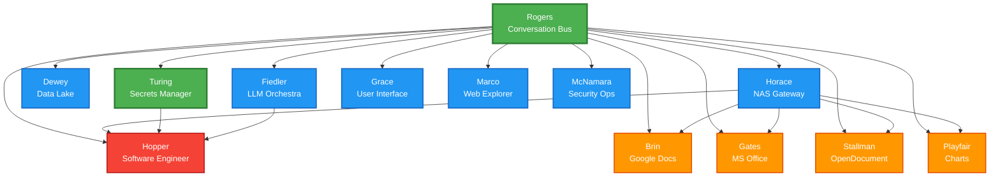

# MAD Dependency Analysis - Implementation Sequencing

**Date:** October 13, 2025
**Purpose:** Inform MAD implementation order to prevent dependency blockers
**Status:** Lightweight analysis for pathfinder guidance

---

## Executive Summary

This analysis establishes a dependency-aware implementation order for all 13 MADs in the Joshua Cellular Monolith. Each MAD is assigned to a **Tier** based on its dependencies, where Tier N can only be implemented after all MADs in Tiers 0 through N-1 are complete.

**Key Findings:**
- **Turing is Tier 0** (minimal dependencies) - Ideal pathfinder candidate
- **Hopper is Tier 3** (depends on Horace, Turing, Fiedler) - Cannot be first pathfinder
- **Rogers must be implemented first** (Tier 0 prerequisite for all other MADs)

---

## Dependency Tiers

### Tier 0: Foundation (No MAD Dependencies)

These MADs have minimal dependencies and can be implemented immediately after infrastructure setup. They provide foundational services for all other MADs.

#### Rogers - Conversation Bus Manager
- **MAD Dependencies:** None (must be first)
- **External Dependencies:** PostgreSQL
- **Rationale:** Central nervous system of ecosystem, all MADs depend on it
- **Implementation Priority:** **#1 - MUST BE FIRST**

#### Turing - Secrets Manager
- **MAD Dependencies:** Rogers only
- **External Dependencies:** PostgreSQL
- **Rationale:** Foundational security service, simple key-value scope
- **Implementation Priority:** **#2 - IDEAL PATHFINDER CANDIDATE**
- **Pathfinder Suitability:** ⭐⭐⭐⭐⭐
  - Simplest conceptual scope (secure key-value store)
  - Foundational dependency for multiple Tier 3 MADs
  - Discrete, easily testable operations
  - Critical for production security

---

### Tier 1: Core Services (Depends on Tier 0 Only)

These MADs provide essential ecosystem services and depend only on Rogers and/or Turing.

#### Dewey - Data Lake Manager
- **MAD Dependencies:** Rogers
- **External Dependencies:** PostgreSQL, NAS
- **Rationale:** Archive conversations, provide long-term memory
- **Implementation Priority:** **#3 - SECOND PATHFINDER CANDIDATE**
- **Pathfinder Suitability:** ⭐⭐⭐⭐
  - Already has V1 baseline (per V1_PHASE1_BASELINE.md)
  - Clear archive/retrieve workflow
  - Minimal external MAD dependencies
  - Good second pathfinder after Turing

#### Fiedler - LLM Orchestra Conductor
- **MAD Dependencies:** Rogers
- **External Dependencies:** External LLM APIs
- **Rationale:** Abstracts LLM access, provides consultation services
- **Implementation Priority:** **#4**
- **Pathfinder Suitability:** ⭐⭐⭐
  - Dependency for Hopper and document specialists
  - Moderate complexity (routing, load balancing)
  - External API dependency adds variability

#### Horace - NAS Gateway
- **MAD Dependencies:** Rogers
- **External Dependencies:** NAS
- **Rationale:** File system abstraction, required by many MADs
- **Implementation Priority:** **#5**
- **Pathfinder Suitability:** ⭐⭐⭐⭐
  - Simple, clear file I/O scope
  - Dependency for all document specialists and Hopper
  - Well-defined operations

#### Grace - User Interface
- **MAD Dependencies:** Rogers
- **External Dependencies:** None (beyond web framework)
- **Rationale:** User-facing interface
- **Implementation Priority:** **#6**
- **Pathfinder Suitability:** ⭐⭐
  - UI complexity less suitable for process validation
  - User experience considerations beyond architecture

#### Marco - Web Explorer
- **MAD Dependencies:** Rogers
- **External Dependencies:** Internet access
- **Rationale:** Web browsing and API interaction
- **Implementation Priority:** **#7**
- **Pathfinder Suitability:** ⭐⭐⭐
  - External internet dependency adds variability
  - Clear tool scope

#### McNamara - Security Operations Coordinator
- **MAD Dependencies:** Rogers (listens to logs)
- **External Dependencies:** None
- **Rationale:** Passive monitoring, security alerting
- **Implementation Priority:** **#8**
- **Pathfinder Suitability:** ⭐⭐
  - Passive/observational nature makes incremental V-stage definitions harder
  - Important but not blocking for other MADs

---

### Tier 2: Document Specialists (Depends on Tier 0 + Tier 1)

These MADs provide specialized document handling and all depend on Horace for file storage.

#### Brin - Google Docs Specialist
- **MAD Dependencies:** Rogers, Horace
- **External Dependencies:** Google Workspace API
- **Rationale:** Google Docs creation/manipulation
- **Implementation Priority:** **#9**

#### Gates - Microsoft Office Specialist
- **MAD Dependencies:** Rogers, Horace
- **External Dependencies:** MS Office libraries (python-docx, etc.)
- **Rationale:** .docx, .xlsx, .pptx manipulation
- **Implementation Priority:** **#10**

#### Stallman - OpenDocument Specialist
- **MAD Dependencies:** Rogers, Horace
- **External Dependencies:** OpenDocument libraries (odfpy)
- **Rationale:** .odt, .ods, .odp manipulation
- **Implementation Priority:** **#11**

#### Playfair - Chart Master
- **MAD Dependencies:** Rogers, Horace
- **External Dependencies:** Visualization libraries (matplotlib, etc.)
- **Rationale:** Chart/graph generation from data
- **Implementation Priority:** **#12**

**Document Specialist Notes:**
- Can be implemented in parallel (no interdependencies)
- All require Horace V1 to be operational first
- Similar architecture patterns (good for template reuse)

---

### Tier 3: Advanced Operations (Depends on Multiple Tiers)

These MADs have complex multi-tier dependencies and should be implemented last.

#### Hopper - Software Engineer
- **MAD Dependencies:** Rogers, Horace, Turing, Fiedler
- **External Dependencies:** Git, various dev tools
- **Rationale:** Autonomous software development
- **Implementation Priority:** **#13**
- **Pathfinder Suitability:** ⭐ (Attempted as first pathfinder, revealed dependency issue)
- **Blocker Dependencies:**
  - **Turing V1** - Required for Git PAT retrieval (all `git_push` operations)
  - **Fiedler V1** - Required for code review consultations
  - **Horace V1** - Required for external config file access
- **Cannot Begin Until:** Turing, Fiedler, and Horace all have operational V1 implementations

---

## Dependency Graph (Mermaid)

---

## Recommended Pathfinder Sequence

Based on this analysis and the strategic consultation with Gemini 2.5 Pro, the recommended pathfinder sequence is:

### 1. Turing V1-V4 (CURRENT PATHFINDER)
**Rationale:**
- Tier 0 dependency with simplest scope
- Foundational for Hopper and other Tier 3 MADs
- Clear success criteria (store/retrieve secrets)
- Unblocks critical security requirements

### 2. Dewey V1-V4 (SECOND PATHFINDER)
**Rationale:**
- Already has V1 baseline (per V1_PHASE1_BASELINE.md)
- Tier 1 with minimal dependencies
- Diverse from Turing (testing archive/retrieval patterns vs key-value)
- Good contrast for V2 (LPPM), V3 (DTR), V4 (CET) validation

### 3. Hopper V1-V4 (RESUME AFTER DEPENDENCIES)
**Rationale:**
- Original pathfinder candidate, valuable work already done
- Can resume after Turing, Fiedler, Horace are complete
- Complex Tier 3 MAD provides good stress test

---

## Implementation Order for Full Rollout

After pathfinders complete, recommended implementation order for remaining MADs:

**Phase 1: Core Infrastructure (V1 for all)**
1. ✅ Rogers V1 (Complete per V1_PHASE1_BASELINE.md)
2. ✅ Dewey V1 (Complete per V1_PHASE1_BASELINE.md)
3. → Turing V1 (Pathfinder in progress)
4. → Fiedler V1
5. → Horace V1

**Phase 2: Interface & Support Services (V1 for all)**
6. → Grace V1
7. → Marco V1
8. → McNamara V1

**Phase 3: Document Specialists (V1 for all, can parallelize)**
9. → Brin V1
10. → Gates V1
11. → Stallman V1
12. → Playfair V1

**Phase 4: Advanced Operations (V1 for all)**
13. → Hopper V1 (Resume pathfinder work)

**Phase 5-8: Progressive Rollout (V2, V3, V4 for all 13 MADs)**
- All MADs advance through V2 (LPPM), V3 (DTR), V4 (CET) in coordinated waves
- Can prioritize critical-path MADs (Turing, Horace, Fiedler) for early V2-V4 advancement

---

## Dependency Matrix

| MAD | Rogers | Turing | Dewey | Fiedler | Horace | Other |
|-----|--------|--------|-------|---------|--------|-------|
| Rogers | - | - | - | - | - | PostgreSQL |
| Turing | ✓ | - | - | - | - | PostgreSQL |
| Dewey | ✓ | - | - | - | - | PostgreSQL, NAS |
| Fiedler | ✓ | - | - | - | - | LLM APIs |
| Horace | ✓ | - | - | - | - | NAS |
| Grace | ✓ | - | - | - | - | - |
| Marco | ✓ | - | - | - | - | Internet |
| McNamara | ✓ | - | - | - | - | - |
| Brin | ✓ | - | - | - | ✓ | Google API |
| Gates | ✓ | - | - | - | ✓ | MS libraries |
| Stallman | ✓ | - | - | - | ✓ | ODF libraries |
| Playfair | ✓ | - | - | - | ✓ | Matplotlib |
| Hopper | ✓ | ✓ | - | ✓ | ✓ | Git |

---

## Critical Insights

### 1. Rogers is the Universal Dependency
- All 12 other MADs depend on Rogers
- Rogers must be implemented first and remain stable
- Any Rogers breaking changes require ecosystem-wide coordination

### 2. Turing Unlocks Tier 3
- Turing is a prerequisite for Hopper (and potentially other future MADs requiring secrets)
- Early Turing implementation provides security foundation

### 3. Horace Enables Document Specialists
- All 4 document specialist MADs depend on Horace
- Horace V1 completion unblocks parallel implementation of Brin, Gates, Stallman, Playfair

### 4. Fiedler is Optional but Valuable
- Only Hopper has explicit Fiedler dependency (for code review consultations)
- However, many MADs may benefit from Fiedler's LLM orchestration in practice
- Consider Fiedler a "soft dependency" for quality enhancement

### 5. Document Specialists are Parallelizable
- Brin, Gates, Stallman, Playfair have no interdependencies
- Can be developed by separate teams simultaneously
- Good candidates for template-driven development

---

## Lessons from Hopper Pathfinder

1. **Always check dependencies before selecting pathfinder MAD**
2. **Tier 0 and Tier 1 MADs are better pathfinder candidates** (simpler, fewer blockers)
3. **Dependency discovery is a pathfinder success, not failure**
4. **Archive incomplete work with clear resumption criteria**

---

## Next Steps

1. ✅ Archive Hopper V1 iteration 3 (Complete)
2. ✅ Create this dependency analysis (Complete)
3. → Begin Turing V1 synthesis (Next)
4. → Complete Turing V1-V4 pathfinder
5. → Complete Dewey V1-V4 pathfinder
6. → Use learnings to refine this dependency analysis
7. → Execute full rollout using tiered implementation order

---

*This analysis prevents future dependency blockers and provides a strategic roadmap for the entire Joshua MAD ecosystem implementation.*
