## 1. V4 End-State Architecture Diagram

This diagram illustrates the fully realized V4 architecture of the Joshua Cellular Monolith, showing the relationships between all 13 core MADs, the central Conversation Bus, user interaction points, and underlying infrastructure services.

```mermaid
graph TD
    subgraph "User Interaction"
        U[User] -- Converses via --> Grace
    end

    subgraph "Joshua Cellular Monolith Ecosystem"
        
        subgraph "Conversation Bus (Core Infrastructure)"
            Rogers("<div style='font-weight:bold'>Rogers</div>Conversation Bus<br/>Manager")
        end

        Grace("<div style='font-weight:bold'>Grace</div>User<br/>Interface")
        
        Rogers --- Grace

        subgraph "Core Service MADs"
            Dewey("<div style='font-weight:bold'>Dewey</div>Data Lake<br/>Manager")
            Fiedler("<div style='font-weight:bold'>Fiedler</div>LLM Orchestra<br/>Conductor")
            Horace("<div style='font-weight:bold'>Horace</div>NAS Gateway<br/>File Manager")
            Marco("<div style='font-weight:bold'>Marco</div>Web<br/>Explorer")
        end

        Rogers --- Dewey
        Rogers --- Fiedler
        Rogers --- Horace
        Rogers --- Marco

        subgraph "Document Specialist MADs"
            Brin("<div style='font-weight:bold'>Brin</div>Google Docs<br/>Specialist")
            Gates("<div style='font-weight:bold'>Gates</div>Microsoft Office<br/>Specialist")
            Stallman("<div style='font-weight:bold'>Stallman</div>OpenDocument<br/>Specialist")
            Playfair("<div style='font-weight:bold'>Playfair</div>Chart<br/>Master")
        end

        Rogers --- Brin
        Rogers --- Gates
        Rogers --- Stallman
        Rogers --- Playfair

        subgraph "Development & Operations MADs"
            Hopper("<div style='font-weight:bold'>Hopper</div>Software<br/>Engineer")
            McNamara("<div style='font-weight:bold'>McNamara</div>Security Ops<br/>Coordinator")
            Turing("<div style='font-weight:bold'>Turing</div>Secrets<br/>Manager")
        end
        
        Rogers --- Hopper
        Rogers --- McNamara
        Rogers --- Turing

        subgraph "Generic V4 MAD Internal Architecture"
            direction LR
            ActionEngine["<div style='font-weight:bold'>Action Engine</div>MCP Server<br/>Tools & Integrations"]
            ThinkingEngine["<div style='font-weight:bold'>Thinking Engine</div>"]
            
            subgraph ThinkingEngine
                direction TB
                DTR["<div style='font-weight:bold'>DTR (V3+)</div>Decision Tree Router"]
                LPPM["<div style='font-weight:bold'>LPPM (V2+)</div>Prose-to-Process Mapper"]
                CET["<div style='font-weight:bold'>CET (V4+)</div>Context Engineering Transformer"]
                Imperator["<div style='font-weight:bold'>Imperator (V1+)</div>Core LLM Reasoner"]
                Consultants["Consulting LLMs<br/>(via Fiedler)"]
                
                DTR --> LPPM
                LPPM --> CET
                CET --> Imperator
                Imperator -- consults --> Consultants
            end
            
            ActionEngine -- To/From Bus --> Rogers
            ActionEngine <--> DTR
            ActionEngine <--> LPPM
            ActionEngine <--> CET
            ActionEngine <--> Imperator
        end
    end

    subgraph "Underlying Infrastructure Services"
        PostgreSQL[("PostgreSQL DB<br/>(rogers, dewey schemas)")]
        NAS[("Network Attached Storage<br/>(File System)")]
        LLM_APIs[("External LLM APIs<br/>(OpenAI, Anthropic, etc)")]
        Docker[("Docker Engine<br/>(Container Runtime)")]
    end

    %% Dependencies
    Rogers -- Stores conversations --> PostgreSQL
    Dewey -- Manages archives in --> PostgreSQL
    Dewey -- Manages data lake on --> NAS
    Horace -- Manages files on --> NAS
    Fiedler -- Provisions LLMs from --> LLM_APIs
    Turing -- Stores encrypted secrets --> PostgreSQL
    McNamara -- Monitors logs from --> Rogers
    Hopper -- Accesses code via --> Horace
    Hopper -- Uses secrets from --> Turing
    Brin & Gates & Stallman & Playfair -- Store/retrieve docs via --> Horace
    Marco -- Accesses Web --> Internet([Internet])
    
    style U fill:#cde4ff,stroke:#6699ff,stroke-width:2px
    style Rogers fill:#f9f,stroke:#333,stroke-width:2px
    style GenericV4MADInternalArchitecture fill:#fff,stroke:#ccc,stroke-width:2px,stroke-dasharray: 5 5
```

## 2. Prose Explanation of the Diagram

### 2.1. Overview

The diagram shows a hub-and-spoke model with the **Conversation Bus (Rogers)** at the absolute center. Every MAD in the ecosystem is connected to Rogers and Rogers alone. This enforces the core principle that all inter-MAD communication must be a conversation. There are no direct point-to-point connections between MADs.

### 2.2. Core Components

*   **User:** The human operator interacts with the entire ecosystem through a single conversational entry point: the **Grace** MAD.
*   **Grace (User Interface):** Grace is the bridge between the human user and the Joshua ecosystem. It manages user sessions, formats output for human readability, and translates user input into conversations on the bus.
*   **Rogers (Conversation Bus Manager):** The heart of the system. Rogers is a persistent, infrastructure-level MAD responsible for creating, managing, and persisting all conversations. It uses a **PostgreSQL** backend to store conversation data, ensuring immutability and history. All other MADs are clients of Rogers.
*   **MAD Groups:** The 12 other MADs are logically grouped by their primary function:
    *   **Core Service MADs:** Provide fundamental capabilities to the entire ecosystem (e.g., data management, file access, web access, LLM orchestration).
    *   **Document Specialist MADs:** Handle specific document formats, from creation to manipulation and analysis.
    *   **Development & Operations MADs:** Focus on the creation, maintenance, and security of the ecosystem itself.
*   **Generic V4 MAD Internal Architecture:** This inset illustrates the internal structure of a fully-developed V4 MAD. It highlights the separation between the **Action Engine** (which interfaces with the outside world and the bus) and the **Thinking Engine** (which provides cognition). The progressive filtering of the Thinking Engine (DTR -> LPPM -> CET -> Imperator) is shown as the primary data path for incoming conversational messages that require intelligence.
*   **Underlying Infrastructure:** These are the non-MAD services upon which the ecosystem runs. This includes the **PostgreSQL** database for structured data and conversations, the **NAS** for the file-based data lake, external **LLM APIs** that Fiedler orchestrates, and the **Docker** runtime that hosts all the MAD containers.

### 2.3. Component Interaction Patterns

*   **Request/Response:** A MAD initiates a conversation with another MAD to request an action. For example, Hopper might start a conversation with Horace: "Please provide the contents of `/src/main.py`." Horace responds in the same conversation with the file content.
*   **Publish/Subscribe:** A MAD can publish information to a conversation that multiple other MADs are listening to. For example, McNamara might publish a security alert to a `#security-ops` conversation, which could be monitored by Hopper, Dewey, and Grace.
*   **Consultation:** A MAD's Imperator can request help. For example, Hopper's Imperator, when tasked with writing complex Go code, will initiate a conversation with Fiedler: "I need a consultation with a Go language specialist LLM and a code reviewer LLM." Fiedler then provisions these models and invites them to a new, temporary conversation with Hopper.
*   **Observation & Archiving:** Dewey is perpetually listening to the metadata of all conversations on the bus via Rogers. It archives completed or inactive conversations from Rogers' "hot" storage into its long-term data lake, ensuring the primary bus remains performant while preserving a complete historical record.

### 2.4. Data Flow Patterns

*   **Inbound User Request:**
    1.  User sends a message to **Grace**.
    2.  Grace's Action Engine creates/forwards the message to a conversation on the **Conversation Bus (Rogers)**, targeting the appropriate MAD (e.g., Hopper).
    3.  Hopper's Action Engine receives the message from Rogers.
    4.  The message enters Hopper's Thinking Engine, passing through the **DTR**, **LPPM**, and **CET** before reaching the **Imperator**.
    5.  The Imperator formulates a plan, which may involve using its own tools (via its Action Engine) or conversing with other MADs (e.g., Turing for a secret, Horace for a file).
*   **Outbound Data Flow:**
    1.  Hopper's Imperator generates a response.
    2.  The response is passed to its Action Engine.
    3.  The Action Engine sends the response message back to the original conversation on the **Conversation Bus (Rogers)**.
    4.  **Grace**, as a participant in the conversation, receives the response and displays it to the User.
*   **Logging Flow:**
    1.  Any MAD's Action Engine generates a log message (e.g., "Successfully wrote file to disk").
    2.  It uses the `joshua_logger` library to format this log as a conversation message.
    3.  It sends the message to a dedicated logging conversation (e.g., `#logs-horace-v1`) on the **Conversation Bus (Rogers)**.
    4.  **McNamara** and **Dewey** are participants in these logging conversations, allowing them to monitor for security events and archive the logs, respectively.

---
---